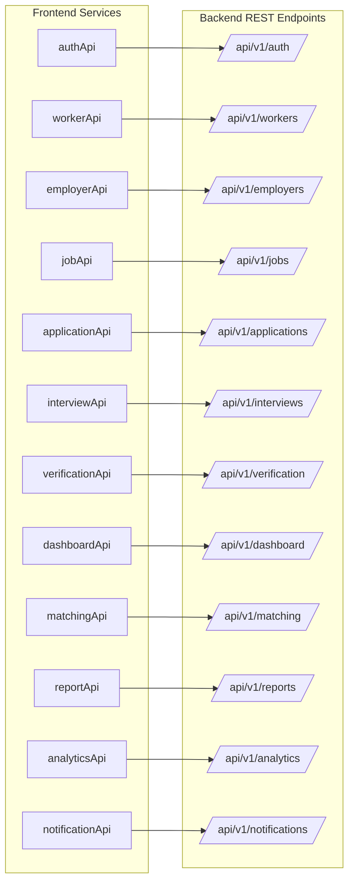
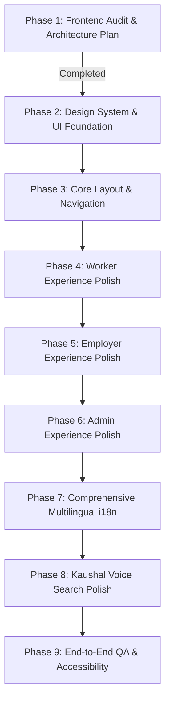

# KaushalConnect — Comprehensive Frontend Audit & Architecture Plan

> **Phase 1 Deliverable:** Frontend Audit & Architecture Planning  
> **Target Application:** KaushalConnect (Blue Workforce Connect '26)  
> **Source of Truth:** Active source code in `src/` and `package.json`

---

## 1. Current Architecture Overview

The KaushalConnect frontend is a Single Page Application (SPA) built with **React 19**, **TypeScript 5.8**, and **Vite 8**. It communicates with the Django REST Framework backend (`/api/v1/`) through a centralized Axios client with automatic JWT token rotation.

```mermaid
graph TD
    subgraph UI & Pages Layer [12 Application Pages]
        Public[LandingPage, AuthPage]
        WorkerPages[WorkerDashboard, JobDiscovery, JobDetail, Applications, Profile]
        EmployerPages[EmployerDashboard, JobCreation, CandidateDiscovery, Pipeline, Analytics]
        AdminPages[AdminDashboard]
    end

    subgraph Component & Layout Layer
        Navbar[Navbar with Role Switch & Language Picker]
        Footer[Global Footer]
        Modals[MatchScoreModal, VoiceSearchModal, NotificationDrawer, TrustScoreWidget]
    end

    subgraph State & Context Layer
        Store[Store: Reactive State & localStorage Cache Sync]
        I18n[I18nProvider: English, Telugu, Hindi]
    end

    subgraph Service & API Layer [13 Typed REST Services]
        APIClient[Axios Client with Bearer Injection & Auto 401 Refresh]
        Services[authApi, workerApi, employerApi, jobApi, applicationApi, etc.]
    end

    UI & Pages Layer --> Component & Layout Layer
    UI & Pages Layer --> State & Context Layer
    State & Context Layer --> Service & API Layer
    Service & API Layer --> APIClient
```

---

## 2. Complete Route Map & Navigation Tree

The application currently routes via hash/pushState navigation mapped inside `src/App.tsx:renderRoute()`:

| Route Path | Page Component | Access Level / Role | Key Purpose & Live Integrations |
| :--- | :--- | :--- | :--- |
| `/` | `LandingPage` | Public | Hero visualizer, value props, sample match preview, quick search. |
| `/auth` | `AuthPage` | Public | Integrated Worker/Employer login & registration, 1-click demo personas. |
| `/worker/dashboard` | `WorkerDashboard` | Worker | Live 100-pt Trust Score gauge, active applications, upcoming trade tests, recommended jobs. |
| `/jobs` or `/worker/jobs` | `JobDiscoveryPage` | Public / Worker | Multi-filter job search (salary range, shift, radius, experience, skills), dynamic sorting. |
| `/worker/jobs/:id` | `JobDetailPage` | Public / Worker | Job specs, benefits, commute map, 91% match diagnostic modal, one-click apply. |
| `/worker/applications` | `ApplicationTrackingPage` | Worker | 7-stage application timeline tracking (`Applied` $\rightarrow$ `Hired`), interview notifications. |
| `/worker/profile` | `WorkerProfilePage` | Worker | Editable trade profile, skills CRUD, NCVT certification upload, photo proof of work gallery. |
| `/employer/dashboard` | `EmployerDashboard` | Employer | Plant KPIs, active job postings, pipeline preview, upcoming assessments. |
| `/employer/jobs/new` | `JobCreationPage` | Employer | Industrial vacancy creator with salary period, shift, required trade skills & tools. |
| `/employer/candidates`| `CandidateDiscoveryPage`| Employer | Searchable candidate talent roster with minimum trust score filter & bookmarking. |
| `/employer/pipeline` | `RecruitmentPipelinePage`| Employer | 7-stage Kanban / list pipeline with stage promotion, rejection reasons & interview scheduling. |
| `/employer/analytics` | `EmployerAnalyticsPage` | Employer | 6-stage recruitment funnel conversion rates, trade breakdown & hiring velocity. |
| `/admin/dashboard` | `AdminDashboard` | Admin | Moderation queue for government credentials/diplomas (Approve/Reject) & platform safety reports. |

---

## 3. User Roles & Access Control

| User Role | Default Landing | Permitted Actions & Boundaries |
| :--- | :--- | :--- |
| **`worker`** | `/worker/dashboard` | Profile management, trade skills, proof-of-work uploads, job search, 1-click applications, interview attendance. |
| **`employer`** | `/employer/dashboard` | Post vacancies, manage applicants, transition pipeline stages, schedule on-site trade tests, submit supervisor reviews. |
| **`admin`** | `/admin/dashboard` | Moderate verification documents (Aadhaar, NCVT certs), investigate platform safety reports, system health audit. |

---

## 4. API Integration Map

The application is connected to 13 modular client services located in `src/services/api/`:



---

## 5. Reusable Components & Modals

| Component | Path | Current Capabilities |
| :--- | :--- | :--- |
| **`Navbar`** | `src/components/layout/Navbar.tsx` | Brand header, role-based nav links, voice search trigger, language switcher, notification badge, quick role preview switcher. |
| **`Footer`** | `src/components/layout/Footer.tsx` | Global footer with platform copyright and quick links. |
| **`MatchScoreModal`** | `src/components/matching/MatchScoreModal.tsx` | 5-pillar compatibility breakdown dialog with strengths, gaps, and radar/bar representations. |
| **`NotificationDrawer`**| `src/components/notifications/NotificationDrawer.tsx` | Slide-out drawer displaying read/unread workflow notifications with mark-as-read controls. |
| **`TrustScoreWidget`** | `src/components/trust/TrustScoreWidget.tsx` | Circular trust gauge with 6-pillar breakdown modal and actionable score improvement tips. |
| **`VoiceSearchModal`** | `src/components/voice/VoiceSearchModal.tsx` | Multilingual simulated voice query assistant supporting English, Telugu, and Hindi. |

---

## 6. Identified UI & UX Inconsistencies

1. **Card Visual Weight & Contrast**:
   - Some pages use `kc-card` with pure white backgrounds on slate-50 canvas, while other sections use custom border classes, leading to inconsistent card padding (`p-4` vs `p-6`) and border-radius (`rounded-xl` vs `rounded-2xl`).
2. **Typography Hierarchy**:
   - Heading font sizes vary across pages (e.g. `text-lg font-black` vs `text-xl font-bold` vs `text-2xl font-black`).
   - Small label text (`text-[10px]` vs `text-[11px]` vs `text-xs`) needs unified design tokens.
3. **Button Styling Fragmentation**:
   - Multiple distinct button styles coexist (`button button--light`, `kc-btn kc-btn-primary`, `bg-blue-600 hover:bg-blue-700 text-white rounded-xl`, `button--outline`).
4. **Information Density on Worker Dashboard**:
   - High visual density on smaller viewports where the Trust Score gauge, active applications, and job recommendations compete for vertical prominence.

---

## 7. Identified Frontend Architecture Problems

1. **Inline / Ad-Hoc Styling vs. Centralized Design System**:
   - 8 separate CSS files (`base.css`, `components.css`, `footer.css`, `landing.css`, `navigation.css`, `production-ui.css`, `utilities.css`, `variables.css`) contain overlapping utility classes that can be streamlined into a unified design system.
2. **State Store Breadth**:
   - `src/services/store.ts` acts as a monolithic repository holding users, candidates, jobs, applications, notifications, verifications, and reports. While this provides instant optimistic UI updates, separating domain-specific slice hooks will improve modularity.
3. **Hardcoded User-Facing Strings**:
   - While `src/i18n/translations.ts` provides comprehensive English, Telugu, and Hindi translations, several newer pages (`JobCreationPage`, `CandidateDiscoveryPage`, `RecruitmentPipelinePage`, `AdminDashboard`) still contain hardcoded English strings instead of calling `t()`.

---

## 8. Hardcoded Text Locations to Internationalize (Phase 7 Preparation)

| File | Hardcoded Elements | Planned Translation Domain |
| :--- | :--- | :--- |
| `src/pages/employer/JobCreationPage.tsx` | Form labels: "Job Title", "Trade Category", "Monthly Salary Range", "Shift", "Post Job Vacancy". | `employer.jobCreation` |
| `src/pages/employer/CandidateDiscoveryPage.tsx`| Filter labels: "Minimum Trust Score", "Primary Trade", "Available Now", "Saved Candidates". | `employer.candidateDiscovery` |
| `src/pages/employer/RecruitmentPipelinePage.tsx`| Stage headers: "Applied", "Screening", "Shortlisted", "Interview", "Selected", "Hired". | `employer.pipeline` |
| `src/pages/admin/AdminDashboard.tsx` | Moderation queue: "Pending Documents", "Approve", "Reject", "Safety Reports", "Resolution Notes".| `admin.moderation` |
| `src/pages/worker/JobDetailPage.tsx` | "Why this match?", "Commute & Location", "Required Tools & Safety Gear", "Apply for this Opening".| `worker.jobDetail` |

---

## 9. Phased Frontend SaaS Refactoring Plan



### Phase Execution Roadmap:
- **Phase 2 (Design System & UI Foundation)**: Consolidate design tokens, color variables, typography hierarchy, standardized button styles, badge systems, and card components.
- **Phase 3 (Core Layout & Navigation)**: Polish `Navbar`, `Footer`, mobile drawer navigation, user role switching, and responsive viewport shells.
- **Phase 4 (Worker Experience)**: Refine `WorkerDashboard`, `JobDiscoveryPage`, `JobDetailPage`, `ApplicationTrackingPage`, and `WorkerProfilePage` with clear information hierarchy.
- **Phase 5 (Employer Experience)**: Refine `EmployerDashboard`, `JobCreationPage`, `CandidateDiscoveryPage`, `RecruitmentPipelinePage`, and `EmployerAnalyticsPage` into an enterprise-grade recruitment workspace.
- **Phase 6 (Admin Experience)**: Streamline `AdminDashboard` verification and safety moderation workflows.
- **Phase 7 (Multilingual Architecture)**: Connect all remaining hardcoded strings in English, Telugu, and Hindi.
- **Phase 8 (Kaushal Voice)**: Enhance voice query feedback and trade matching.
- **Phase 9 (Polish, Accessibility & QA)**: WCAG contrast check, keyboard navigation, and production build verification.
