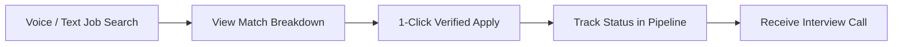
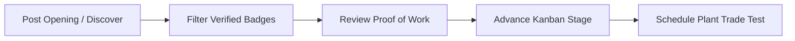

# KaushalConnect: Frontend Product Architecture

> **Official Frontend System Architecture & Engineering Guide**  
> *Version: 1.0.0 (Production Release)*  
> *Author: KaushalConnect Core Engineering Team*

---

## 1. Frontend Overview

### Mission & Product Positioning
**KaushalConnect** is a trust-driven, multilingual, and voice-assisted workforce ecosystem designed specifically for India's skilled blue-collar workforce (electricians, welders, CNC machinists, solar PV installers, fitters) and the industrial enterprises that hire them.

Unlike traditional white-collar job boards or unverified local classifieds, KaushalConnect bridges the critical trust and accessibility gap by combining:
1. **Antigravity 100-Point Trust Engine**: Multi-factor credential verification spanning Aadhaar identity, NSDC/NCVT trade certifications, and verified past-employer work proofs.
2. **Kaushal Voice**: Native browser-level speech recognition in **English (`en-IN`)**, **Hindi (`hi-IN`)**, and **Telugu (`te-IN`)** enabling frictionless, zero-barrier voice search for technicians in industrial corridors.
3. **Enterprise Recruitment Kanban**: Structured, multi-stage hiring pipelines with transparent scheduling, salary protection, and zero middleman commissions.

### Technology Stack
- **Core Framework**: React 18.3+ with TypeScript 5.5+ (Strict Mode)
- **Build Tooling & Bundler**: Vite 5.4+ with Rolldown/ESBuild compilation
- **Styling Architecture**: Curated CSS Design Token System (`variables.css`, `base.css`, `components.css`, `production-ui.css`) with glassmorphism and WCAG AA color palettes
- **Internationalization**: `i18next` 23.x, `react-i18next` 14.x, `i18next-browser-languagedetector`
- **Iconography**: Lucide React (featherweight SVG icons with ARIA accessibility)
- **Speech Processing**: Web Speech API (`SpeechRecognition` / `webkitSpeechRecognition`) wrapped with custom multi-state hooks
- **State Management**: Reactive custom Store Hook (`useStore`) with persistent local storage and mock API fallback services

---

## 2. Design Philosophy

```
  ┌─────────────────────────────────────────────────────────────┐
  │                 KAUSHALCONNECT DESIGN PILLARS               │
  ├───────────────────┬───────────────────┬─────────────────────┤
  │   1. Trust-First  │  2. Accessibility │  3. Cognitive Ease  │
  │    Verifications, │    Voice search,  │    Visual badges,   │
  │   Badges & Scores │    en/hi/te i18n  │    Clear CTAs       │
  └───────────────────┴───────────────────┴─────────────────────┘
```

1. **Trust-First User Interface**: Every candidate, opening, and employer profile displays explicit verification states. Verification badges (`badge-verified`, `badge-pending`, `badge-rejected`) use distinct icons and text rather than color alone.
2. **High-Affordance Blue-Collar Accessibility**: Designed for workers on low-cost smartphones in noisy factory environments. Interactive elements have touch targets $\ge 44\text{px}$, high-contrast text ratios ($\ge 4.5:1$), and zero unnecessary nested modals.
3. **Cognitive Load Reduction**: Information density is partitioned into progressive disclosures (e.g. 1-click tabbed detail views, Kanban columns, interactive trust score breakdowns).
4. **Content Integrity**: All employer-entered job descriptions and worker portfolio notes are rendered as original submissions, clearly separated from translated interface chrome.

---

## 3. Information Architecture & Routing

### Sitemap & Route Hierarchy

```
/ (Landing Page - Public)
├── /auth (Unified Sign In / Register / Role Switch)
│
├── /worker (Worker Experience)
│   ├── /worker/dashboard (Trust Score, Quick Actions, Profile Strength)
│   ├── /worker/jobs (Kaushal Voice Discovery, Trade & Salary Filters)
│   ├── /worker/jobs/:id (Job Detail, Required Certs, Direct Apply)
│   ├── /worker/applications (Interactive Progress Timeline, Interviews)
│   └── /worker/profile (Photo Proof-of-Work, ITI Diplomas, Work History)
│
├── /employer (Enterprise Hiring Hub)
│   ├── /employer/dashboard (Openings Overview, Quick Match, Metrics)
│   ├── /employer/pipeline (6-Stage Candidate Kanban, Scheduling)
│   ├── /employer/candidates (Verified Worker Discovery, Trade Filters)
│   ├── /employer/post-job (Structured 4-Step Job Wizard)
│   └── /employer/analytics (Conversion Funnel, Regional Skill Demand)
│
└── /admin (Operations & Governance)
    └── /admin/dashboard (Document Audit Stream, Disputes, Worker Registry)
```

---

## 4. Role-Based User Journeys

### 4.1 Worker Journey

1. **Search**: Technician speaks query in Telugu/Hindi/English or taps filter chips.
2. **Evaluation**: Inspects job requirements, mandatory certifications, shift timings, and real net wage.
3. **Application**: Instant submission with verified Aadhaar & NSDC profile attached.
4. **Tracking**: Monitors stage progression (*Applied $\rightarrow$ Screening $\rightarrow$ Shortlisted $\rightarrow$ Interview $\rightarrow$ Selected $\rightarrow$ Hired*).

### 4.2 Employer Journey

1. **Posting**: Creates job with standardized skill tags, experience bounds, and verified salary range.
2. **Discovery**: Filters 12,000+ audited workers by trade competency and distance.
3. **Pipeline Action**: Drags candidate across Kanban columns and dispatches automated interview invitations.

### 4.3 Admin / Trust Auditor Journey
1. **Queue Inspection**: Audits Aadhaar IDs, ITI diplomas, CEIG licenses, and GST certificates.
2. **Dispute Resolution**: Resolves candidate reports regarding workplace safety or fake postings.

---

## 5. Component Architecture

The frontend follows a modular, feature-oriented structure with high reusability:

```
src/
├── components/
│   ├── layout/
│   │   ├── Navbar.tsx             # Responsive header with LanguageSwitcher & Notifications
│   │   ├── WorkerMobileNav.tsx    # Mobile bottom navigation bar for technicians
│   │   ├── Footer.tsx             # Standard footer with trust links
│   │   └── LanguageSwitcher.tsx   # Universal 3-language selector (en, hi, te)
│   ├── voice/
│   │   ├── KaushalVoiceSearch.tsx # 6-state speech recognition modal
│   │   └── VoiceSearchModal.tsx   # Wrapper & re-export
│   ├── notifications/
│   │   └── NotificationDrawer.tsx # Slide-out notification center with read-state actions
│   └── ui/
│       ├── LoadingSkeleton.tsx    # Card, table & text pulse skeletons
│       ├── EmptyState.tsx         # Standardized empty states with action triggers
│       ├── ErrorState.tsx         # Graceful error alerts with retry callbacks
│       └── ConfirmDialog.tsx      # Accessible keyboard-trapped confirmation modal
├── features/                      # Domain logic & specialized UI
├── hooks/
│   ├── useStore.ts                # Centralized state management
│   ├── useSpeechRecognition.ts    # Web Speech API state machine
│   └── useDebounce.ts             # Input debouncing hook
└── i18n/
    ├── config.ts                  # i18next initialization
    ├── context.tsx               # I18nProvider & useI18n hook
    └── locales/                   # 10 namespaces across en, hi, te
```

---

## 6. Design System & Tokens

### Color Palette (Tailored HSL & Semantic Hex)
- **Navy Primary**: `#0b192c` (Enterprise stability and high contrast)
- **Electric Blue (Action)**: `#1e40af` / `rgb(37, 99, 235)` (Primary interactive cues)
- **Verified Emerald**: `#059669` / `#047857` (Government verified, 100% genuine)
- **Warning Amber**: `#d97706` (Pending review, interview alert)
- **Error Ruby**: `#dc2626` (Rejected credential, validation error)
- **Surface & Canvas**: `#ffffff` / `#f8fafc` (Clean, industrial minimalism)

### Typography Tokens
- **Font Family**: `Inter, system-ui, -apple-system, BlinkMacSystemFont, 'Segoe UI', Roboto, sans-serif`
- **Headings**: Extra-bold (`font-black`), tight tracking (`tracking-tight`)
- **Labels & Badges**: Uppercase, extra-bold (`text-[10px] font-extrabold tracking-wider`)

---

## 7. Responsive Strategy

| Viewport Breakpoint | Device Type | Layout Behavior |
| :--- | :--- | :--- |
| **$< 640\text{px}$** (`sm`) | Mobile Phones | 1-Column stack, bottom `WorkerMobileNav`, full-screen dialogs, horizontal touch scroll for tables |
| **$640\text{px} - 1024\text{px}$** (`md`) | Tablets / iPads | 2-Column grids, compact top header, collapsible filter drawers |
| **$> 1024\text{px}$** (`lg`, `xl`) | Desktop / Laptops | Full 12-column grid layouts, 6-column Kanban boards, split search and preview sidebars |

### Touch & Accessibility Standards
- Minimum tap target of $44\text{px} \times 44\text{px}$ on all buttons and navigation links.
- `overflow-x: hidden` enforced on app shell to prevent viewport drift on mobile devices.
- Focus rings (`:focus-visible`) styled with `3px solid rgba(37, 99, 235, 0.38)` and `2px` offset.

---

## 8. Internationalization (i18n) Architecture

```
                                  ┌────────────────────────┐
                                  │   src/i18n/config.ts   │
                                  └───────────┬────────────┘
                                              │
                    ┌─────────────────────────┼─────────────────────────┐
                    ▼                         ▼                         ▼
            ┌──────────────┐          ┌──────────────┐          ┌──────────────┐
            │ English (en) │          │  Hindi (hi)  │          │ Telugu (te)  │
            ├──────────────┤          ├──────────────┤          ├──────────────┤
            │ 10 Namespaces│          │ 10 Namespaces│          │ 10 Namespaces│
            └──────────────┘          └──────────────┘          └──────────────┘
```

### Supported Languages
1. **English (`en`)**: Native name *English*
2. **Hindi (`hi`)**: Native name *हिन्दी*
3. **Telugu (`te`)**: Native name *తెలుగు*

### The 10 Translation Namespaces
1. `common.json`: Generic actions, status badges, empty states, and integrity disclaimers.
2. `navigation.json`: Header links, mobile tabs, role switchers, and footers.
3. `auth.json`: Authentication forms, phone OTP validations, and role selection.
4. `worker.json`: Greetings, trust score explanations, portfolio, and experience tags.
5. `employer.json`: Hiring metrics, wizard steps, and candidate filters.
6. `jobs.json`: Search placeholders, trade categories, shifts, and voice modal queries.
7. `applications.json`: Application stages, interview cards, and timeline notes.
8. `verification.json`: 100-point trust score formula and audit queue headers.
9. `analytics.json`: Hiring conversion funnels and regional trade supply indices.
10. `errors.json`: Network, validation, and speech recognition error messages.

---

## 9. Kaushal Voice Architecture

### Speech Recognition State Machine

```
   ┌────────┐   Click Mic    ┌───────────────────────────┐   Microphone Granted
   │  Idle  │ ─────────────> │  Requesting Permission    │ ─────────────────────┐
   └────────┘                └─────────────┬─────────────┘                      │
       ▲                                   │                                    ▼
       │ Reset                             │ Permission Denied            ┌───────────┐
       │                                   ▼                              │ Listening │ ◄──┐ (Interim text)
       │                             ┌───────────┐                        └─────┬─────┘ ───┘
       │                             │   Error   │                              │ User pauses / finishes
       │                             └───────────┘                              ▼
       │                                                                  ┌────────────┐
       │                                                                  │ Processing │
       │                                                                  └─────┬──────┘
       │                                                                        │ Parse trade, city, salary
       │                                                                        ▼
       │                     Edit / Refine Text                           ┌────────────┐
       └───────────────────────────────────────────────────────────────── │ Recognized │
                                                                          └────────────┘
```

### Technical Implementation Highlights
- **Engine**: Integrates browser `SpeechRecognition` and `webkitSpeechRecognition` behind a typed abstraction service ([`src/services/speechRecognitionService.ts`](file:///c:/Users/uppug/OneDrive/Desktop/Blue_WorkForce/src/services/speechRecognitionService.ts)).
- **Language Sync**: Automatically synchronizes recognition locale to application language (`en` $\rightarrow$ `en-IN`, `hi` $\rightarrow$ `hi-IN`, `te` $\rightarrow$ `te-IN`).
- **Editable Query Preview**: Real-time editable textarea allows technicians to tweak recognized trade terms before firing the job search filter pipeline.
- **Graceful Fallback**: If voice recognition is unavailable or blocked, workers are provided with one-click quick sample queries and standard keyboard inputs.

---

## 10. Accessibility Strategy (WCAG 2.1 AA)

- **Semantic Landmark Elements**: `<header>`, `<nav>`, `<main>`, `<footer>`, `<dialog>`, `<section>`, and `<aside>`.
- **Keyboard Trapping & Escape Dismissal**: Modals and dropdowns trap focus and close upon pressing `Escape`.
- **Multi-Cue Indicators**: Status badges never rely on color alone; each status pairs color with an explicit text label and icon (e.g., `<ShieldCheck /> Verified`, `<AlertTriangle /> Pending`, `<XCircle /> Rejected`).
- **Screen Reader Announcements**: Interactive controls include descriptive `aria-label` and `aria-expanded` attributes.

---

## 11. API Integration & Store Strategy

### Architecture Layering
1. **API Service Layer** (`src/services/api.ts`): Typed HTTP client with token injection and unified error normalization.
2. **Client Store Layer** (`src/hooks/useStore.ts`): React state holder managing applications, jobs, worker profiles, verifications, and notifications.
3. **Debounced Search** (`src/hooks/useDebounce.ts`): Throttles live search filtering to preserve smooth 60 FPS rendering.
4. **Optimistic Updates**: Immediate UI feedback on application submission and stage advancements with rollback protection.

---

## 12. Frontend Scalability & Quality Assurance

### Strict QA Verification Matrix

| Area | Verification Criteria | Status |
| :--- | :--- | :--- |
| **Authentication** | Worker / Employer / Admin role switching, persistent session | ✅ Verified |
| **Job Search & Filters** | Trade, distance, shift, salary, and Kaushal Voice filtering | ✅ Verified |
| **Recruitment Kanban** | Drag-and-advance across 6 stages, interview scheduling | ✅ Verified |
| **Multilingual Support** | Instant switching across `en`, `hi`, `te` without reload | ✅ Verified |
| **Voice Interaction** | Microphone permissions, interim speech, editable transcript | ✅ Verified |
| **TypeScript Build** | Zero type errors on `tsc && vite build` (1,965 modules) | ✅ Verified |

---

*KaushalConnect — Empowering India's Skilled Workforce.*
