# ⚡ KaushalConnect (कौशल कनेक्ट)

> **A Trust-Driven Professional Identity and Intelligent Recruitment Platform for India's Blue-Collar Workforce**  
> *Built for the Blue Workforce Connect '26 Hackathon by Wooble*

[](https://opensource.org/licenses/MIT)
[](https://www.djangoproject.com/)
[](https://react.dev/)
[](http://127.0.0.1:8000/api/docs/)
[](https://vitejs.dev/)

---

## 📖 Table of Contents
- [Executive Overview](#-executive-overview)
- [The Problem & Our Solution](#-the-problem--our-solution)
- [Core Differentiators & Innovation](#-core-differentiators--innovation)
- [Key Features](#-key-features)
- [System Architecture](#-system-architecture)
- [Technology Stack](#-technology-stack)
- [Quick Start Guide](#-quick-start-guide)
- [Demo Credentials](#-demo-credentials)
- [Complete Documentation Index](#-complete-documentation-index)
- [Future Vision & Roadmap](#-future-vision--roadmap)

---

## 🌟 Executive Overview

Over 300 million skilled blue-collar and technical trade workers drive India's manufacturing, infrastructure, and renewable energy industries. Yet, technical recruitment remains broken—dominated by resume forgery, informal word-of-mouth networks, and exploitative middleman agencies.

**KaushalConnect** is a full-stack recruitment and professional identity platform designed to bring institutional trust and algorithmic matching to blue-collar hiring. Technicians build a verified digital identity backed by an objective **100-Point Trust Score**, **Photo Proof-of-Work Portfolios**, and **Explainable Match Scoring**, enabling industrial employers to discover, verify, and hire qualified technical talent in days rather than months.

---

## 🔍 The Problem & Our Solution

```mermaid
graph TD
    subgraph Traditional Blue-Collar Hiring
        P1[Paper Biodatas / Unverified Claims] --> P2[Middlemen Extract 20% Wages]
        P2 --> P3[30+ Days Plant Hiring Delays]
        P3 --> P4[High On-Site Trial Failures]
    end

    subgraph The KaushalConnect Solution
        S1[Aadhaar eKYC & Verified NCVT Certs] --> S2[100-Point Transparent Trust Score]
        S2 --> S3[Photo Proof-of-Work Showcases]
        S3 --> S4[5-Pillar Explainable AI Matching]
        S4 --> S5[Structured 7-Stage Plant Hiring Pipeline]
    end
```



---

## 💡 Core Differentiators & Innovation

1. **Evidence-Backed Professional Identity**: Technicians showcase high-resolution photos of completed physical craftsmanship (transformer overhauls, 6G pipe welds, CNC aerospace tooling) alongside accredited diplomas.
2. **100-Point Deterministic Trust Score**: Credibility is scored across 6 verifiable pillars (Identity, Certifications, Verified Skills, Plant Experience, Supervisor Reviews, and Proof of Work).
3. **Transparent Explainable Matching**: Compatibility scores feature plain-language diagnostics explaining positive strengths and missing skill gaps.
4. **Demand-Driven Career Intelligence**: Recommends high-yield skills currently demanded by regional factories to help technicians increase their earning power.
5. **Full-Cycle Recruitment Pipeline**: End-to-end management from application screening to plant trade test scheduling and verified supervisor reviews.

---

## ✨ Key Features

| Role | Key Capabilities |
| :--- | :--- |
| **👨‍🔧 Worker Portal** | • Dynamic digital trade profile with skill ratings and NCVT certification repository<br>• Visual Photo Proof-of-Work portfolio gallery<br>• Multi-parameter job search (salary range, shift, radius, experience)<br>• Instant match score diagnostic breakdown modal<br>• 7-stage application timeline tracking<br>• Live career gap insights highlighting missing high-paying skills |
| **🏭 Employer Portal** | • Enterprise job posting management (active, paused, closed)<br>• Candidate discovery with minimum trust score and verified trade filters<br>• Interactive 7-stage recruitment pipeline with transition audit logs<br>• Plant assessment & on-site trade test scheduler<br>• Supervisor performance review submission for hired candidates<br>• 6-stage recruitment funnel analytics and conversion KPIs |
| **🛡️ Admin Portal** | • Document verification queue for government IDs and ITI trade diplomas<br>• Immediate approve/reject moderation with feedback notes<br>• Platform trust and safety incident report resolution |
| **🌐 Accessibility** | • Multilingual localization supporting **English, Telugu, and Hindi**<br>• Multilingual voice search assistant with simulated voice queries |

---

## 🏗️ System Architecture

```mermaid
graph TB
    subgraph Frontend [Client Layer - React 19 + TypeScript]
        UI[User Interface Views & Components]
        Store[Reactive State Store & LocalStorage Sync]
        APIClient[Axios Client with Auto JWT Rotation]
        I18n[Multilingual Context - EN / TE / HI]
    end

    subgraph Backend [Application Layer - Django 5.2 + DRF 3.16]
        Router[REST API Versioning Table /api/v1/]
        AuthGuards[RBAC Permission Guards: IsWorker / IsEmployer / IsAdmin]
        
        subgraph Domain Apps [Domain Applications]
            Accounts[apps.accounts - Auth & User]
            Workers[apps.workers - Digital Identity & Skills]
            Employers[apps.employers - Enterprise Profiles]
            Jobs[apps.jobs - Vacancy Management]
            Applications[apps.applications - 7-Stage Pipeline]
            Verification[apps.verification - Document Moderation]
            Matching[apps.matching - 5-Pillar Matching Engine]
            Analytics[apps.analytics - Funnels & Dashboards]
            Reports[apps.reports - Trust & Safety]
            Notifications[apps.notifications - Platform Alerts]
        end
    end

    subgraph Data Layer [Persistence Layer]
        ORM[Django ORM]
        DB[(Relational DB: SQLite / PostgreSQL)]
        Docs[OpenAPI 3.0 / Swagger UI]
    end

    UI --> Store
    Store --> APIClient
    APIClient -->|JSON / Bearer JWT| Router
    Router --> AuthGuards
    AuthGuards --> Domain Apps
    Domain Apps --> ORM
    ORM --> DB
    Domain Apps --> Docs
```

---

## 🛠️ Technology Stack

- **Frontend**: React 19, TypeScript 5.8, Vite 8, Lucide React, Canvas Confetti, Modular CSS Design System.
- **Backend**: Python 3.11+, Django 5.2, Django REST Framework 3.16, SimpleJWT, `django-filter`, `drf-spectacular`.
- **Database**: SQLite (Local Dev / Demo) / PostgreSQL 15+ (Production Ready).
- **API Documentation**: OpenAPI 3.0, Swagger UI (`/api/docs/`), ReDoc (`/api/redoc/`).

---

## 🚀 Quick Start Guide

### 1. Clone & Backend Setup
```bash
git clone https://github.com/Navadeep-maganti/Blue_WorkForce.git
cd Blue_WorkForce/backend

# Install dependencies
pip install -r requirements.txt

# Run migrations
python manage.py migrate

# Seed realistic demo data (26 workers, 6 employers, 17 jobs, 36 applications)
python manage.py seed_demo

# Start Django API server
python manage.py runserver 127.0.0.1:8000
```
*API is live at `http://127.0.0.1:8000/api/v1/` | Swagger Docs at `http://127.0.0.1:8000/api/docs/`.*

### 2. Frontend Setup
```bash
# In the root directory (Blue_WorkForce)
npm install
npm run dev
```
*Web application is live at `http://localhost:5173/`.*

---

## 🔑 Demo Credentials

All demo accounts are pre-seeded with rich data and standard password `password123`:

| Role | Username / Email | Password | What You Can Test |
| :--- | :--- | :--- | :--- |
| **👨‍🔧 Worker** | `worker@demo.com` | `password123` | Ramesh Kumar: 99/100 Trust Score, Photo Proof of Work, Active Applications, Career Gap Insights. |
| **🏭 Employer**| `employer@demo.com` | `password123` | ABC Precision Industries: Job Creation, 7-Stage Pipeline, Trade Test Scheduling, Analytics. |
| **🛡️ Admin** | `admin@demo.com` | `password123` | Platform Moderation: Document Verification Queue, Approve/Reject Actions, Safety Reports. |

---

## 📚 Complete Documentation Index

Deep dive into the comprehensive architecture and specifications in the [`docs/`](./docs) directory:

| Document | Description |
| :--- | :--- |
| [**IMPLEMENTATION_AUDIT.md**](./docs/IMPLEMENTATION_AUDIT.md) | Technical audit of the codebase, verified models, views, and capabilities. |
| [**PROJECT_OVERVIEW.md**](./docs/PROJECT_OVERVIEW.md) | High-level product overview, problem statement, and core value propositions. |
| [**ARCHITECTURE.md**](./docs/ARCHITECTURE.md) | Decoupled client-server architecture, modular design, and security layers. |
| [**DATABASE_DESIGN.md**](./docs/DATABASE_DESIGN.md) | 16 relational models, complete ER diagram, composite indexes, and constraints. |
| [**API_DOCUMENTATION.md**](./docs/API_DOCUMENTATION.md) | REST API reference covering endpoints, query filters, and response envelopes. |
| [**FEATURES.md**](./docs/FEATURES.md) | Detailed feature specifications, user problems solved, and technical logic. |
| [**INTELLIGENCE_ENGINE.md**](./docs/INTELLIGENCE_ENGINE.md) | 5-pillar explainable matching, 100-pt trust scoring, and career gap algorithms. |
| [**SECURITY.md**](./docs/SECURITY.md) | Stateless JWT strategy, Role-Based Access Control, and data protection policies. |
| [**USER_FLOWS.md**](./docs/USER_FLOWS.md) | End-to-end visual sequence diagrams for workers, employers, and administrators. |
| [**TECHNOLOGY_STACK.md**](./docs/TECHNOLOGY_STACK.md) | Complete technology justifications and architectural trade-offs. |
| [**SCALABILITY.md**](./docs/SCALABILITY.md) | Current scalability characteristics and horizontal cloud scaling strategy. |
| [**DEPLOYMENT.md**](./docs/DEPLOYMENT.md) | Step-by-step local development and production deployment instructions. |
| [**TESTING.md**](./docs/TESTING.md) | Automated testing scripts, API test suites, and manual QA checklists. |
| [**INNOVATION_AND_UNIQUENESS.md**](./docs/INNOVATION_AND_UNIQUENESS.md) | Competitive differentiation against traditional job boards and staffing agencies. |
| [**FUTURE_ROADMAP.md**](./docs/FUTURE_ROADMAP.md) | Future strategic roadmap including DigiLocker, WhatsApp bots, and native mobile apps. |

---

## 🔮 Future Vision & Roadmap

- **DigiLocker & Skill India Integration**: Direct government API integration for instant NCVT trade credential verification.
- **WhatsApp & SMS Bot**: Apply for jobs and receive interview alerts directly via WhatsApp without internet browsers.
- **Vector Search (`pgvector`)**: Machine learning vector embeddings bridging colloquial trade terms with formal job titles.
- **Escrow Wage Protection**: Automated milestone wage payouts upon plant supervisor sign-off.

---

## 👥 Team & Hackathon Submission

- **Project**: KaushalConnect
- **Event**: Blue Workforce Connect '26 Hackathon by Wooble
- **Theme**: Blue-Collar Workforce Empowerment & Industrial Recruitment Innovation
- **License**: MIT
