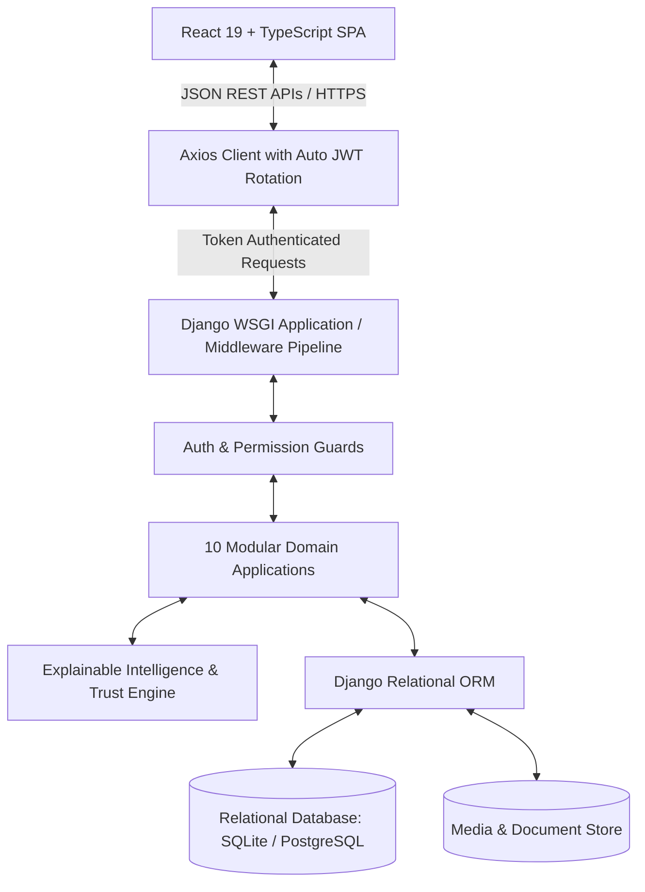
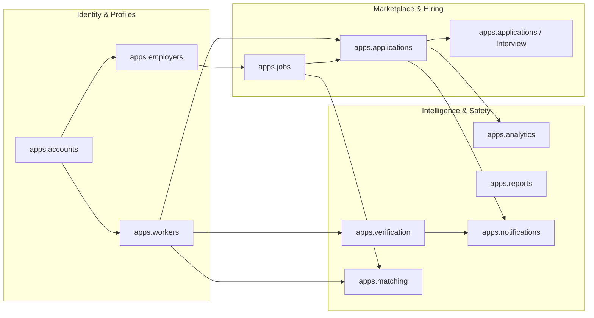
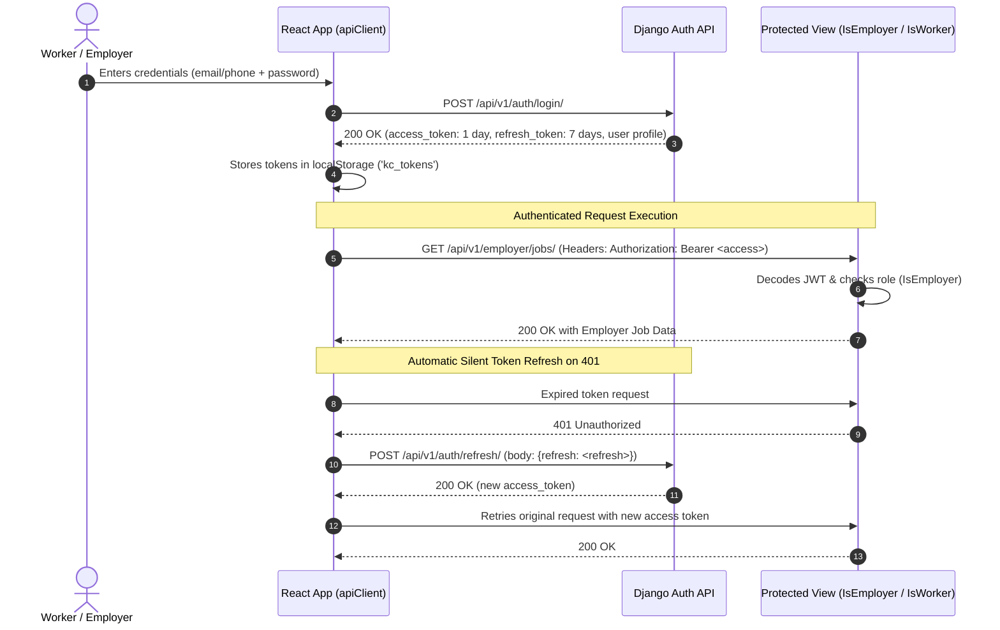

# KaushalConnect — System Architecture Documentation

---

## 1. Architecture Overview & Core Principles

KaushalConnect is engineered with a **Decoupled Client-Server Architecture** designed for high throughput, strict domain separation, stateless security, and zero downtime resilience. The system isolates the user presentation layer (React SPA) from the backend business logic and persistence layers (Django REST Framework + Relational Store).



### Architectural Principles
1. **Stateless API Design**: All authentication is encapsulated within signed JSON Web Tokens (JWT). Server instances retain zero session state, enabling horizontal replication behind load balancers.
2. **Domain-Driven Modularity**: Distinct business concerns (Workers, Employers, Jobs, Verification, Matching, Applications) are compartmentalized into isolated Django apps with explicit inter-app service boundaries.
3. **Deterministic & Explainable Business Logic**: Matching and trust calculations operate strictly through deterministic scoring algorithms to ensure complete auditability.
4. **Standardized Response Contracts**: All API responses follow a uniform JSON envelope (`success`, `data`, `message`, `errors`, `meta`), preventing frontend runtime crashes.
5. **Optimized Data Access**: All list and discovery views use eager-loading (`select_related`, `prefetch_related`) combined with composite database indexes to ensure zero N+1 database queries.

---

## 2. High-Level System Architecture

```mermaid
graph TB
    subgraph Client Layer [Frontend Client Layer - React 19]
        UI[User Interface Components]
        Store[Reactive State Store & LocalStorage Sync]
        API_Services[13 Typed API Client Modules]
        I18n[Multilingual Context - EN / TE / HI]
        Voice[Simulated Multilingual Voice Assistant]
    end

    subgraph Transport Layer [Network & Transport]
        HTTP[HTTPS / JSON REST API]
        JWT_H[Authorization: Bearer Access Token]
    end

    subgraph Backend Layer [Django REST Framework Backend]
        Middleware[CORS, Security & Exception Handling Middleware]
        Router[API URL Versioning Table /api/v1/]
        
        subgraph Domain Apps [Domain Applications]
            Acc[apps.accounts - Identity & Auth]
            Wrk[apps.workers - Digital Profile & Trust]
            Emp[apps.employers - Enterprise Profiles]
            Job[apps.jobs - Vacancies & Filters]
            App[apps.applications - 7-Stage Pipeline]
            Int[apps.applications.interviews - Assessments]
            Ver[apps.verification - Document Moderation]
            Mat[apps.matching - Explainable Match Engine]
            Not[apps.notifications - Platform Alerts]
            Anl[apps.analytics - Funnel & Aggregations]
            Rep[apps.reports - Trust & Safety Moderation]
        end
    end

    subgraph Data Layer [Persistence Layer]
        ORM_Engine[Django ORM QuerySet Engine]
        DB_SQL[(Relational Database: SQLite / PostgreSQL)]
        Media_Disk[Media Storage: Proof of Work & Documents]
    end

    UI --> Store
    Store --> API_Services
    API_Services --> HTTP
    HTTP --> Router
    Router --> Middleware
    Middleware --> Domain Apps
    Domain Apps --> ORM_Engine
    ORM_Engine --> DB_SQL
    Domain Apps --> Media_Disk
```

---

## 3. Frontend Architecture

The client application is built as a modern Single Page Application (SPA) using React 19 and TypeScript:

### Directory Structure & Responsibilities
- `src/pages/`: Role-segregated views for Workers (`JobDiscoveryPage`, `WorkerDashboard`, `WorkerProfilePage`, `ApplicationTrackingPage`, `JobDetailPage`), Employers (`EmployerDashboard`, `JobCreationPage`, `CandidateDiscoveryPage`, `RecruitmentPipelinePage`, `EmployerAnalyticsPage`), Admins (`AdminDashboard`), and Public visitors (`LandingPage`, `AuthPage`).
- `src/components/`: Reusable, design-system-aligned UI components grouped by domain (`matching/MatchScoreModal`, `notifications/NotificationDrawer`, `voice/VoiceSearchModal`, `layout/Navbar`, `layout/Footer`).
- `src/services/api/`: 13 specialized TypeScript service modules wrapping Axios HTTP calls (`authApi`, `workerApi`, `employerApi`, `jobApi`, `applicationApi`, `interviewApi`, `verificationApi`, `dashboardApi`, `matchingApi`, `reportApi`, `analyticsApi`, `notificationApi`, `apiClient`).
- `src/services/store.ts`: Reactive state manager with local storage persistence and automated background sync with REST APIs.
- `src/i18n/`: Internationalization provider supplying translations in English (`en`), Telugu (`te`), and Hindi (`hi`).
- `src/styles/`: Tailored CSS design system with custom properties, responsive breakpoints, dark/light theme tokens, and glassmorphism styling.

---

## 4. Backend Modular Application Architecture

The backend isolates distinct functional domains to maintain clean separation of concerns:



---

## 5. Authentication & Authorization Security Flow

The system employs stateless JWT (JSON Web Tokens) with a dual-token strategy:



### Role-Based Access Control (RBAC) Matrix
- **`IsWorker`**: Enforces that the requesting user possesses `role == 'worker'`. Protects worker profile edits, skill additions, certification uploads, and job application submissions.
- **`IsEmployer`**: Enforces that the requesting user possesses `role == 'employer'`. Protects job vacancy creation, application stage transitions, trade test scheduling, candidate bookmarking, and recruitment analytics.
- **`IsAdmin` / `IsStaff`**: Restricts document verification approvals/rejections and platform fraud report resolution to verified platform administrators.

---

## 6. Standardized Response Format

Every REST API endpoint returns a standardized JSON structure:

```json
{
  "success": true,
  "message": "Operation completed successfully.",
  "data": { ... },
  "errors": null,
  "meta": {
    "count": 42,
    "next": "http://127.0.0.1:8000/api/v1/jobs/?page=2",
    "previous": null
  }
}
```

In error conditions, `success` becomes `false`, `data` is `null`, and `errors` provides detailed field-level validation dictionaries with an appropriate HTTP status code (400, 401, 403, 404, 500).

---

## 7. Scalability & Performance Strategy

1. **Composite Query Indexes**: Added on high-cardinality multi-filter fields (`Job[status, created_at]`, `Job[trade_category, city, status]`, `WorkerProfile[primary_trade, city]`).
2. **Eager Loading**: `select_related('employer')` on Jobs and `select_related('user')` on WorkerProfiles eliminates N+1 query overhead.
3. **Stateless Scale-Out**: The Django application layer can scale horizontally behind Nginx / AWS ALB with zero server session replication needed.
