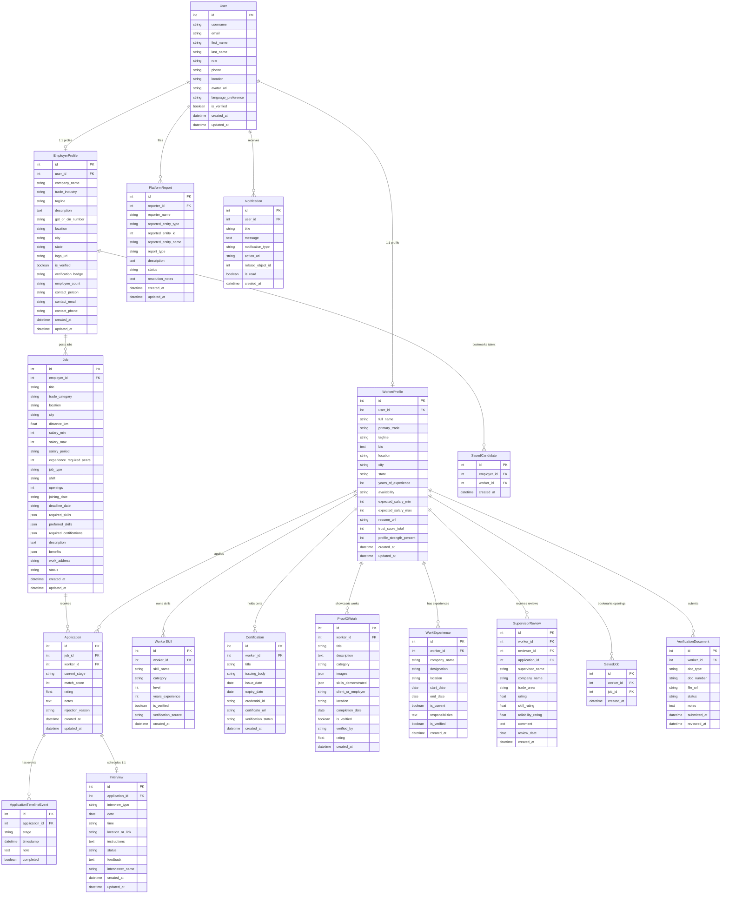

# KaushalConnect — Database Design & Schema Documentation

---

## 1. Database Overview & Technology

The KaushalConnect persistence layer is built on a **Relational Schema** managed through Django ORM migrations. It supports SQLite for local development and zero-configuration demonstration, and PostgreSQL (with `pgvector` compatibility) for production deployment.

The database consists of **16 normalized relational models** organized into domain clusters with explicit foreign key cascades, unique constraints, and composite query indexes.

---

## 2. Complete Entity-Relationship Diagram (ERD)

---

## 3. Core Database Entities & Field Specifications

### 3.1 `accounts.User` (Extends `AbstractUser`)
- **`role`**: `CharField` (`choices=['worker', 'employer', 'admin']`, `default='worker'`, indexed).
- **`phone`**: `CharField(max_length=20, blank=True)`.
- **`location`**: `CharField(max_length=255, blank=True)`.
- **`avatar_url`**: `URLField(max_length=500, blank=True)`.
- **`language_preference`**: `CharField(choices=['en', 'te', 'hi'], default='en')`.
- **`is_verified`**: `BooleanField(default=False, db_index=True)`.

---

### 3.2 `workers.WorkerProfile`
- **`user`**: `OneToOneField(User, on_delete=CASCADE, related_name='worker_profile')`.
- **`primary_trade`**: `CharField(max_length=100, db_index=True)` (e.g. Electrician, Welder, CNC Operator).
- **`years_of_experience`**: `PositiveIntegerField(default=0, db_index=True)`.
- **`availability`**: `CharField(choices=['available_now', 'within_15_days', 'within_1_month', 'not_available'])`.
- **`trust_score_total`**: `PositiveIntegerField(default=0, db_index=True)` (0 to 100 points).
- **`expected_salary_min` / `expected_salary_max`**: Monthly salary expectations in INR.

---

### 3.3 `jobs.Job`
- **`employer`**: `ForeignKey(EmployerProfile, on_delete=CASCADE, related_name='jobs')`.
- **`trade_category`**: `CharField(max_length=100, db_index=True)`.
- **`salary_min` / `salary_max`**: `PositiveIntegerField` with `salary_period='monthly'`.
- **`experience_required_years`**: `PositiveIntegerField(default=0, db_index=True)`.
- **`job_type`**: `CharField(choices=['Full-time', 'Part-time', 'Contract', 'Shift-based'])`.
- **`shift`**: `CharField(choices=['Day Shift', 'Night Shift', 'Rotational', 'Flexible'])`.
- **`required_skills` / `preferred_skills`**: `JSONField(default=list)`.
- **`status`**: `CharField(choices=['active', 'draft', 'paused', 'closed'], default='active', db_index=True)`.

---

### 3.4 `applications.Application`
- **`job`**: `ForeignKey(Job, on_delete=CASCADE, related_name='applications')`.
- **`worker`**: `ForeignKey(WorkerProfile, on_delete=CASCADE, related_name='applications')`.
- **`current_stage`**: `CharField(choices=['Applied', 'Screening', 'Shortlisted', 'Interview', 'Selected', 'Hired', 'Rejected'], default='Applied', db_index=True)`.
- **`match_score`**: `PositiveIntegerField(default=0)` (Calculated explainable compatibility).
- **Constraint**: `unique_together = ['job', 'worker']` (Prevents duplicate applications).

---

## 4. Performance Indexes & Data Integrity Constraints

| Table | Index Name / Fields | Purpose |
| :--- | :--- | :--- |
| `jobs_job` | `[status, created_at]` | High-speed default catalog sorting |
| `jobs_job` | `[trade_category, city, status]` | Fast multi-field discovery queries |
| `jobs_job` | `[salary_min, salary_max]` | Fast salary range boundary filtering |
| `jobs_job` | `[job_type, shift]` | Fast shift/employment type filtering |
| `jobs_job` | `[experience_required_years]` | Fast experience threshold filtering |
| `workers_workerprofile` | `[primary_trade, city]` | Fast candidate geo-trade discovery |
| `workers_workerprofile` | `[trust_score_total, availability]` | High-trust available candidate search |
| `workers_workerprofile` | `[years_of_experience]` | Experience-based candidate filtering |
| `accounts_user` | `[role, is_verified]` | Fast authentication & permission check |
| `jobs_savedjob` | `unique_together = ['worker', 'job']` | Prevents duplicate bookmark records |
| `employers_savedcandidate` | `unique_together = ['employer', 'worker']` | Prevents duplicate saved candidate records |
| `applications_application` | `unique_together = ['job', 'worker']` | Restricts one application per worker/job |
| `workers_supervisorreview`| `unique_together = ['reviewer', 'worker', 'application']` | Restricts one verified review per hired application |
