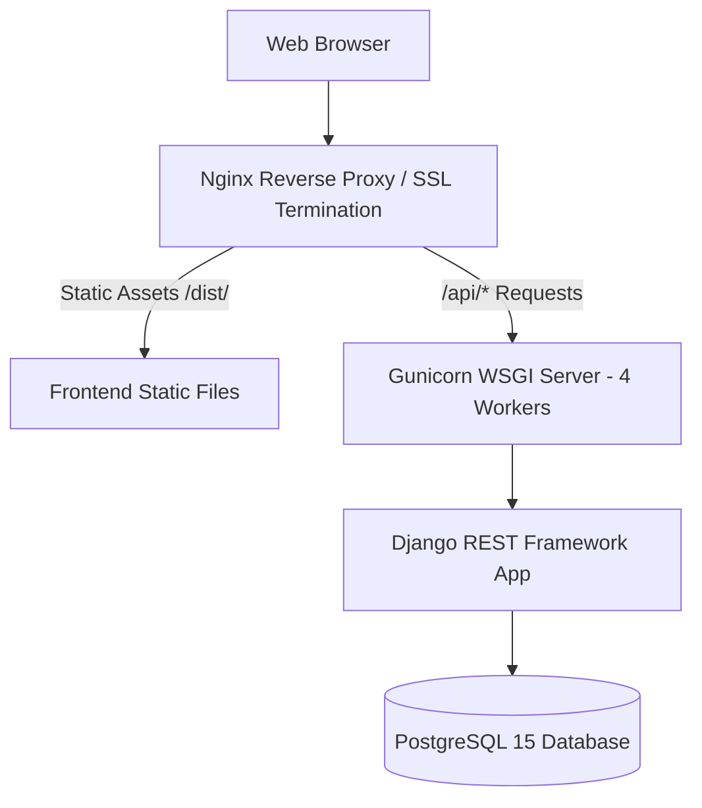

# KaushalConnect — Local Setup & Production Deployment Guide

---

## 1. Prerequisites & System Requirements

Before running or deploying KaushalConnect, ensure your environment meets the following specifications:

- **Node.js**: v18.0.0 or higher (v20+ recommended)
- **Package Manager**: `npm` v9.0.0+ or `yarn` / `pnpm`
- **Python**: v3.10, v3.11, or v3.12
- **Operating System**: Windows, macOS, or Linux (Ubuntu 22.04 LTS recommended for production)
- **Database**: SQLite (Included for Zero-Config Local Dev) or PostgreSQL 15+ (Production)

---

## 2. Quick-Start Local Development Setup

### 2.1 Backend Setup (Django REST Framework)

1. Open a terminal and navigate to the `backend/` directory:
   ```bash
   cd backend
   ```

2. (Optional) Create and activate a Python virtual environment:
   ```bash
   # Windows (PowerShell)
   python -m venv venv
   .\venv\Scripts\Activate.ps1

   # macOS / Linux
   python3 -m venv venv
   source venv/bin/activate
   ```

3. Install required Python dependencies:
   ```bash
   pip install -r requirements.txt
   ```

4. Apply database migrations:
   ```bash
   python manage.py migrate
   ```

5. Seed realistic Indian blue-collar workforce demo data:
   ```bash
   python manage.py seed_demo
   ```

6. Start the local Django development API server:
   ```bash
   python manage.py runserver 127.0.0.1:8000
   ```
   *The backend API will be live at `http://127.0.0.1:8000/api/v1/` and Swagger docs at `http://127.0.0.1:8000/api/docs/`.*

---

### 2.2 Frontend Setup (React 19 + TypeScript + Vite)

1. Open a separate terminal in the project root directory:
   ```bash
   cd Blue_WorkForce
   ```

2. Install Node dependencies:
   ```bash
   npm install
   ```

3. Start the Vite development server:
   ```bash
   npm run dev
   ```
   *The application UI will be accessible at `http://localhost:5173/`.*

---

## 3. Demo Login Credentials

The `seed_demo` management command automatically sets up ready-to-use demo accounts with pre-populated profiles, applications, and assessments:

| Role | Username / Email | Password | Primary Purpose |
| :--- | :--- | :--- | :--- |
| **👨‍🔧 Worker** | `worker@demo.com` | `password123` | Demonstrates Ramesh Kumar (99/100 Trust Score, Proof of Work, applications). |
| **🏭 Employer**| `employer@demo.com` | `password123` | Demonstrates ABC Precision Industries (Plant jobs, 6-stage pipeline, analytics). |
| **🛡️ Admin** | `admin@demo.com` | `password123` | Demonstrates platform moderation queue, document approvals, and report resolution. |

---

## 4. Environment Configuration

### Backend `.env` (Optional Override)
```env
DJANGO_SECRET_KEY=django-insecure-kaushalconnect-production-secret-key
DEBUG=True
ALLOWED_HOSTS=*
DATABASE_URL=sqlite:///db.sqlite3
```

### Frontend `.env`
```env
VITE_API_BASE_URL=http://127.0.0.1:8000/api/v1
```

---

## 5. Production Build & Deployment Architecture



### Production Build Steps:
1. Build the production React bundle:
   ```bash
   npm run build
   ```
   *Generates minified static assets in `dist/`.*

2. Run Django with Gunicorn behind Nginx:
   ```bash
   gunicorn config.wsgi:application --bind 0.0.0.0:8000 --workers 4 --timeout 60
   ```

---

## 6. Health Checks & Verification

- **API Health Check**: `GET http://127.0.0.1:8000/api/schema/` $\rightarrow$ `HTTP 200 OK`
- **Swagger Documentation**: `GET http://127.0.0.1:8000/api/docs/` $\rightarrow$ `HTTP 200 OK`
- **Frontend Compilation**: `npm run build` $\rightarrow$ `✓ built in ~1.5s with 0 errors`
