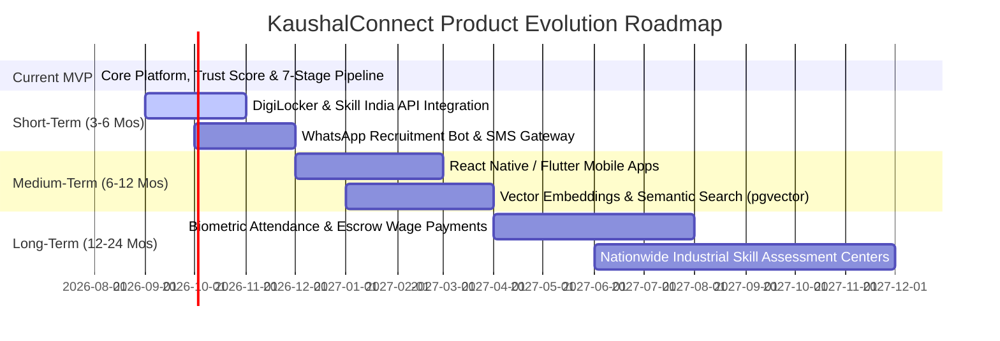

# KaushalConnect — Strategic Future Product Roadmap

---

## 1. Roadmap Horizon Overview

> **Important Distinction**: *This document outlines strategic enhancements planned for future development beyond the core hackathon MVP.*

---

## 2. Phased Roadmap Details

### 2.1 Current MVP (✅ Implemented & Verified)
- 10-app modular Django REST Framework backend with stateless SimpleJWT authentication.
- Full React 19 + TypeScript frontend with role-segregated worker, employer, and admin interfaces.
- 100-Point Deterministic Trust Score across 6 objective pillars.
- 5-Pillar Explainable AI Matching Engine generating transparent strengths and gaps.
- 7-Stage Recruitment Pipeline with integrated on-site trade test scheduling and supervisor reviews.
- Multi-parameter public job and worker discovery engines with composite database indexing.
- Demand-driven career gap insights and skill recommendations.
- Interactive OpenAPI 3.0 documentation (`/api/docs/` and `/api/redoc/`).

---

### 2.2 Short-Term Horizon (3–6 Months)
1. **Direct DigiLocker & Skill India API Integration**:
   - Automated zero-touch verification of NCVT, SCVT, and ITI trade certificates using government DigiLocker APIs.
2. **WhatsApp Bot & Two-Way SMS Workflow**:
   - Enable blue-collar workers to receive interview reminders, apply to jobs, and share proof of work directly via WhatsApp Business API without needing constant browser access.
3. **Automated Geolocation Commute Matching**:
   - Integration with OpenStreetMap / Google Distance Matrix API for real-time plant transit commute estimates.

---

### 2.3 Medium-Term Horizon (6–12 Months)
1. **Native Mobile Applications (Android / iOS)**:
   - Offline-first React Native / Flutter app with low-bandwidth image compression for proof-of-work photo uploads.
2. **Vector Embeddings & Semantic Trade Search (`pgvector`)**:
   - Machine learning vector embeddings to bridge vernacular trade colloquialisms with formal industrial job classifications.
3. **Automated Video Screening & Trade Interview Recording**:
   - In-app video recording for remote technical interviews and welding coupon inspections.

---

### 2.4 Long-Term Horizon (12–24 Months)
1. **Biometric UPI Escrow & Timely Wage Protection**:
   - Smart-contract-backed milestone wage escrow to guarantee timely payment upon plant supervisor sign-off.
2. **Standardized Practical Assessment Centers (KaushalLabs)**:
   - Physical testing hubs in major industrial belts (Autonagar, Peenya, Manesar, Guindy) for standardized 6G welding, CNC calibration, and HT substation trade test certifications.
