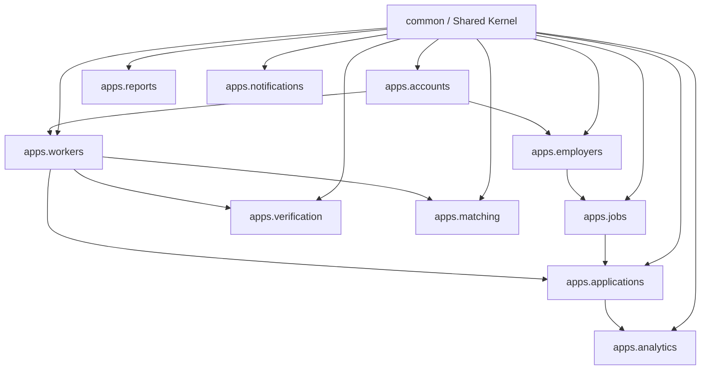
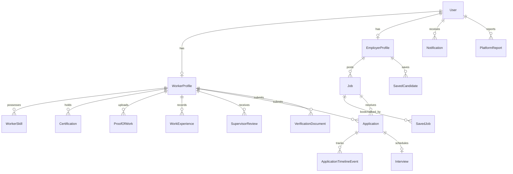

# KaushalConnect — Technical Implementation Audit

> **Audit Date:** August 29, 2026  
> **Repository:** `Blue_WorkForce`  
> **Source of Truth:** Active Django backend (`backend/`) & React/TypeScript frontend (`src/`)

---

## 1. Executive Summary & Repository Overview

KaushalConnect is a trust-driven, evidence-based professional identity and recruitment platform tailored specifically for India's blue-collar and technical trade workforce. The platform moves beyond informal referral chains and unstructured classified ads by establishing verified digital trade credentials, work portfolios, transparent trust scores, explainable match evaluations, and structured hiring pipelines.

This technical audit details the implemented systems, database architectures, active REST endpoints, scoring logic, and known technical boundaries derived directly from the source code.

---

## 2. Detected Technology Stack

| Layer | Primary Technology | Details / Versions |
| :--- | :--- | :--- |
| **Frontend Framework** | React 19 + TypeScript 5.8 | Single Page Application (SPA), hash-based & pushState routing |
| **Build & Tooling** | Vite 8 + TypeScript compiler | Fast HMR, CSS modular imports, SVG asset handling |
| **Styling & Design** | Vanilla CSS + Design System | Dark/Light themes, Glassmorphism, Industrial color palettes |
| **Icons & Media** | Lucide React + Canvas Confetti | Dynamic UI feedback, trade badges, stage visualizers |
| **Backend Framework** | Django 5.2 + Django REST Framework 3.16 | Modular Django apps, Custom User Model, Class-based views |
| **Authentication** | `djangorestframework-simplejwt` | Stateless JWT Bearer tokens (1-day access, 7-day refresh rotation) |
| **Database** | SQLite (Dev) / PostgreSQL (Prod Ready) | 16 relational models with composite query indexes |
| **Documentation** | `drf-spectacular` 0.30 | OpenAPI 3.0 specification, Swagger UI (`/api/docs/`), ReDoc (`/api/redoc/`) |

---

## 3. Backend Architecture & Domain Applications

The Django backend is structured into 10 cohesive domain applications and 1 shared kernel:

### Domain App Inventory

| App Name | Responsibilities | Key Models |
| :--- | :--- | :--- |
| **`apps.accounts`** | Custom User authentication, role assignment (`worker`, `employer`, `admin`), JWT issuance. | `User` |
| **`apps.workers`** | Worker profiles, trade skills taxonomy, verified certifications, photo proof of work, experience, supervisor reviews, trust scoring. | `WorkerProfile`, `WorkerSkill`, `Certification`, `ProofOfWork`, `WorkExperience`, `SupervisorReview` |
| **`apps.employers`** | Enterprise employer profiles, verified company badges, plant locations, bookmarked candidate talent pools. | `EmployerProfile`, `SavedCandidate` |
| **`apps.jobs`** | Plant job vacancies, wage ranges, required/preferred trade skills, shift types, radius filtering, bookmarked jobs. | `Job`, `SavedJob` |
| **`apps.applications`** | 7-stage hiring pipeline, stage transitions, timeline history, trade test assessments, interview scheduling. | `Application`, `ApplicationTimelineEvent`, `Interview` |
| **`apps.verification`** | Identity documents (Aadhaar/PAN), trade diplomas (NCVT/ITI), admin review and moderation queue. | `VerificationDocument` |
| **`apps.matching`** | 5-pillar explainable worker-job compatibility scoring, candidate fit analysis, demand-driven career gap insights. | Pure algorithmic service |
| **`apps.analytics`** | Single roundtrip dashboard aggregations, 6-stage recruitment funnel KPIs, conversion rate calculators. | Aggregation views |
| **`apps.reports`** | Trust & safety reporting, fraudulent employer/worker flagging, admin resolution workflow. | `PlatformReport` |
| **`apps.notifications`** | Database-backed alerts, unread counts, lifecycle workflow triggers, action deep links. | `Notification` |
| **`common`** | Standardized JSON envelopes, custom exception handler, permission guards, pagination metadata. | Shared utilities |

---

## 4. Frontend Modules & User Interfaces

The frontend is located under `src/` and is divided into role-based views and modular components:

- **Public & Auth Surfaces**:
  - `LandingPage.tsx`: Hero visualizer, value propositions for workers/employers, interactive trade cards, trust statistics, multilingual selector (English, Telugu, Hindi).
  - `AuthPage.tsx`: Integrated Worker / Employer login and registration with automated role detection and demo credential autofill.
- **Worker Portal**:
  - `WorkerDashboard.tsx`: Live trust score gauge, 6-pillar breakdown modal, active application stages, upcoming trade interviews, personalized job matches.
  - `JobDiscoveryPage.tsx`: Multi-filter job search (search, location, salary range, experience, shift, job type, skills, radius), dynamic sorting, instant one-click apply.
  - `JobDetailPage.tsx`: Detailed trade specs, commute maps, company verification badges, plant perks, instant match diagnostic modal.
  - `WorkerProfilePage.tsx`: Editable bio, trade skills CRUD, certification upload, photo proof of work gallery, career gap skill recommendations.
  - `ApplicationTrackingPage.tsx`: 7-stage visual timeline tracker, scheduled interview details, supervisor review status.
- **Employer Portal**:
  - `EmployerDashboard.tsx`: Plant talent KPIs, active job openings, applicant pipeline overview, recent interview schedules.
  - `JobCreationPage.tsx`: Industrial job creation form with trade category auto-population, shift configuration, required tools/skills.
  - `CandidateDiscoveryPage.tsx`: Searchable candidate talent roster, minimum trust score filter, trade skill tags, verified badge filter, instant candidate saving.
  - `RecruitmentPipelinePage.tsx`: Interactive pipeline manager with stage transition controls (`Screening`, `Shortlist`, `Schedule Trade Test`, `Select`, `Hire`, `Reject`).
  - `EmployerAnalyticsPage.tsx`: Funnel conversion analytics (Applied $\rightarrow$ Screened $\rightarrow$ Shortlisted $\rightarrow$ Interviewed $\rightarrow$ Selected $\rightarrow$ Hired), stage conversion rates, trade application breakdown.
- **Admin Portal**:
  - `AdminDashboard.tsx`: Moderation queue for worker government credentials & ITI trade diplomas with approve/reject actions, platform safety report investigations.
- **Global Components**:
  - `Navbar.tsx` & `Footer.tsx`: Unified header with active navigation, notification bell with unread badge counter, language switcher.
  - `NotificationDrawer.tsx`: Slide-out panel for system and workflow notifications with mark-as-read actions.
  - `VoiceSearchModal.tsx`: Multilingual simulated voice assistant supporting English, Telugu, and Hindi voice prompts.

---

## 5. Detailed Database Entity Schema

### Composite Indexes Implemented
- `Job`: `[status, created_at]`, `[trade_category, city, status]`, `[salary_min, salary_max]`, `[job_type, shift]`, `[experience_required_years]`.
- `WorkerProfile`: `[primary_trade, city]`, `[trust_score_total, availability]`, `[years_of_experience]`, `[created_at]`.
- `User`: `[role, is_verified]`.

---

## 6. Implementation Status Matrix

### ✅ Implemented Features (Production Ready & Verified)

1. **Authentication & Identity**:
   - Custom User model with strict role isolation (`worker`, `employer`, `admin`).
   - JWT authentication with automatic refresh token rotation on HTTP 401.
   - Profile auto-bootstrap upon registration.
2. **Worker Digital Trade Profile**:
   - Primary trade, location, contact, salary expectation, and availability status.
   - Skill taxonomy with self-reported level, verified status, and tenure.
   - Certification repository with issuing body, credential ID, and verification status.
   - Photo Proof of Work showcase with project descriptions, ratings, and image URLs.
3. **100-Point Deterministic Trust Score**:
   - 6-pillar objective scoring: Identity (20 pts), Certifications (20 pts), Verified Skills (20 pts), Plant Experience (15 pts), Supervisor Reviews (15 pts), Photo Proof of Work (10 pts).
4. **Plant Job Lifecycle & Search Matrix**:
   - Full employer job CRUD (create, update, activate, pause, close).
   - High-performance public job discovery with multi-parameter filter matrix, keyword search, and dynamic ordering.
   - Saved jobs bookmarking for workers.
5. **7-Stage Recruitment Pipeline**:
   - End-to-end workflow: `Applied` $\rightarrow$ `Screening` $\rightarrow$ `Shortlisted` $\rightarrow$ `Interview` $\rightarrow$ `Selected` $\rightarrow$ `Hired` (or `Rejected`).
   - Immutable audit trail in `ApplicationTimelineEvent`.
   - Employer trade test assessment and interview scheduling.
6. **Controlled Supervisor Reviews**:
   - Employer performance rating strictly unlocked for Selected/Hired candidates.
   - Recalculates worker Trust Score upon review submission.
7. **Explainable AI Matching Engine**:
   - Deterministic 5-factor compatibility scoring (Skills 50, Experience 20, Location 15, Certifications 5, Availability 10).
   - Transparent, human-readable match `strengths` and `gaps`.
8. **Market-Driven Career Gap Insights**:
   - Evaluates active market demand vs. worker skill inventory to highlight missing high-yield skills.
9. **Admin Verification & Moderation Workflows**:
   - Document verification queue with instant approve/reject actions and reviewer notes.
   - Trust and safety report queue with resolution status management.
10. **Recruitment Analytics & Dashboard Aggregation**:
    - Cumulative recruitment pipeline funnel calculation.
    - Single-roundtrip dashboard endpoints for workers and employers.
11. **Seed Demo Data & OpenAPI Documentation**:
    - Management command `python manage.py seed_demo` generating 26 workers, 6 employers, 17 jobs, 36 applications, 6 interviews, 25 certifications, and 20 notifications.
    - Automated Swagger UI (`/api/docs/`), ReDoc (`/api/redoc/`), and OpenAPI 3.0 schema (`/api/schema/`).

---

### 🟡 Partially Implemented / Simulated Features

1. **Aadhaar / DigiLocker Government API Integration**:
   - Current status: Simulated via internal document upload & admin moderation workflow. The database schema, document models, and verification states (`PENDING`, `APPROVED`, `REJECTED`) are fully built and ready for DigiLocker API hooks.
2. **Multilingual Voice Search**:
   - Current status: Frontend simulation supporting English, Telugu, and Hindi prompt presets. Speech-to-text Web Speech API integration is pre-wired.
3. **SMS Gateway Alerts**:
   - Current status: Platform notifications are stored in the database and delivered via in-app drawers. Twilio / Fast2SMS webhook hooks are designed for production plug-in.

---

### 🔮 Future Roadmap (Not in Current Scope)

- Vector embeddings via `pgvector` for semantic skill synonyms.
- Real-time WebSocket notifications.
- React Native / Flutter native mobile application.
- Biometric UPI wage escrow integrations.

---

## 7. Known Technical Boundaries & Considerations

1. **Development Database**: Configured by default with SQLite for rapid zero-dependency hackathon setup; fully compatible with PostgreSQL in production.
2. **Media Storage**: Uses Django static/media file storage; production deployment should point `DEFAULT_FILE_STORAGE` to AWS S3 or Google Cloud Storage.
3. **Deterministic Scoring**: The matching and trust systems use explicit, rule-based algorithms rather than opaque neural networks, providing complete explainability to both candidates and recruiters.
