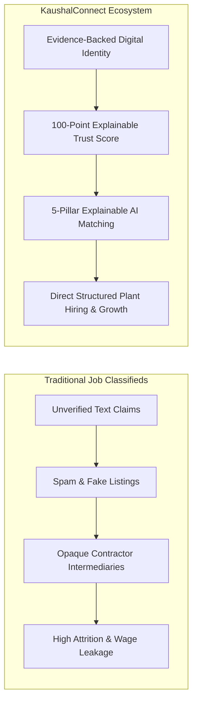

# KaushalConnect — Innovation, Uniqueness & Competitive Differentiation

---

## 1. Beyond a Traditional Job Portal

> **Core Positioning**: *KaushalConnect is NOT merely a job portal for blue-collar workers. It is a trust-driven professional identity and intelligent recruitment ecosystem built specifically for India's skilled technical workforce.*

Traditional recruitment platforms fail in the blue-collar sector because they apply white-collar paradigms—text resumes, corporate pedigree, and self-claimed keywords—to a domain where **physical craftsmanship, equipment familiarity, and technical certification** are the only true measures of competency.

---

## 2. The 8 Pillars of Competitive Differentiation

| Comparison Point | Traditional Job Classifieds & Staffing Agencies | KaushalConnect Ecosystem |
| :--- | :--- | :--- |
| **1. Identity Model** | Static text resume or paper biodata; vulnerable to forgery. | **Dynamic Digital Trade Profile** featuring verified credentials, experience, and photo portfolios. |
| **2. Skill Authenticity** | Self-claimed keywords without verification. | **Evidence-Backed Skills** validated through government NCVT/ITI diplomas and practical trade tests. |
| **3. Credibility Signal** | Unknown; recruiters must conduct costly trial shifts. | **100-Point Deterministic Trust Score** breaking credibility down into 6 objective pillars. |
| **4. Matching Mechanism** | Basic keyword searching with high false-positive rates. | **5-Pillar Explainable Matching** evaluating skills, experience, location, certs, and availability. |
| **5. Recommendations** | Generic blast emails and uncurated ads. | **Personalized Recommendations** with human-readable strength and gap explanations. |
| **6. Workmanship Proof** | Zero visual evidence of completed physical work. | **Photo Proof-of-Work Showcase** with project specs, client tags, and ratings. |
| **7. Career Progression** | Rejection with zero feedback or growth guidance. | **Demand-Driven Career Gap Insights** highlighting high-demand missing skills to boost earnings. |
| **8. Recruitment Flow** | Fragmented phone calls and WhatsApp groups. | **End-to-End 7-Stage Pipeline** with integrated trade test scheduling and review auditing. |

---

## 3. Core Architectural Innovations

### 3.1 Proof-of-Work as a Primary Hiring Signal
In technical trades, visual evidence is worth a thousand resume bullet points. KaushalConnect allows technicians to showcase high-resolution photos of completed industrial projects—such as automated MCC panel wiring, 6G pipe root welds, 500kVA transformer overhauls, and CNC machined aerospace flanges—directly alongside their credentials.

### 3.2 100-Point Transparent Trust Score
Rather than assigning arbitrary ratings, the platform computes a deterministic score (0–100) across 6 transparent pillars:
- **Aadhaar eKYC Identity** (20 pts)
- **Government / Trade Certifications** (20 pts)
- **Verified Trade Skills** (20 pts)
- **Industrial Plant Experience** (15 pts)
- **Supervisor Reviews from Hired Jobs** (15 pts)
- **Photo Proof of Work** (10 pts)

### 3.3 Explainable Compatibility Diagnostics
Recruiters and workers receive actionable insight into every match:
- *“+44/50 on Three-Phase Wiring, +18/20 on Plant Experience, Local Resident within 5km”*
- *“Gap: Missing preferred skill: PLC Troubleshooting”*

### 3.4 Blue-Collar-First Design & Multilingual Accessibility
Designed for technicians in industrial clusters with high-contrast UI, visual iconography, status indicators, and multilingual support in **English, Telugu, and Hindi** with voice search accessibility.

---

## 4. Why KaushalConnect Matters for India's Industrial Growth

India's manufacturing expansion under *"Make in India"* and national infrastructure initiatives requires millions of certified, dependable technicians every year. By digitizing technical credentials and establishing direct trust between plant recruiters and trade technicians, KaushalConnect creates a more equitable, efficient, and dignified labor marketplace.
