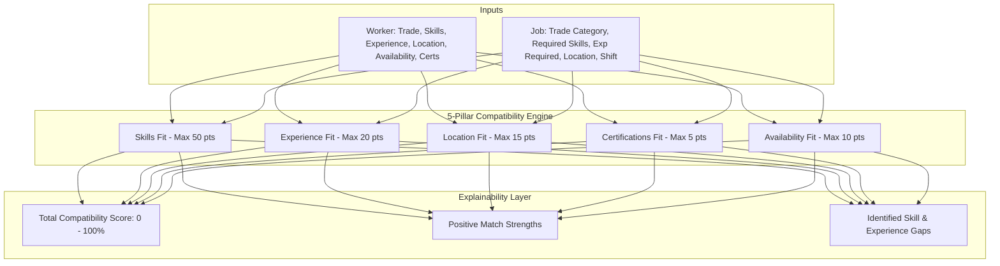
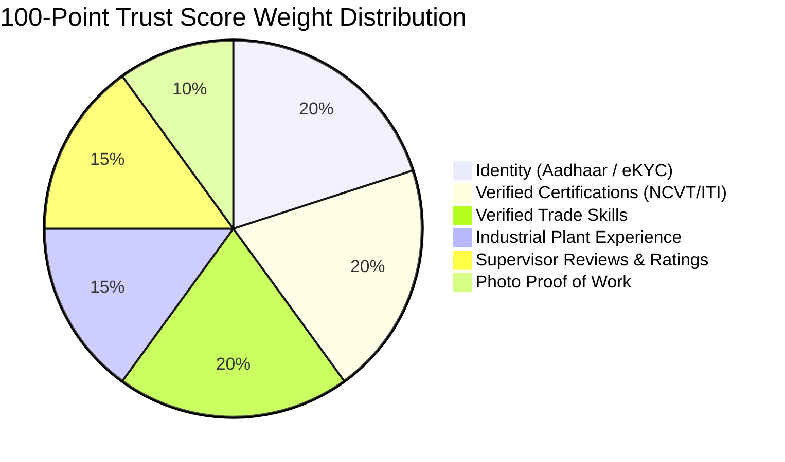
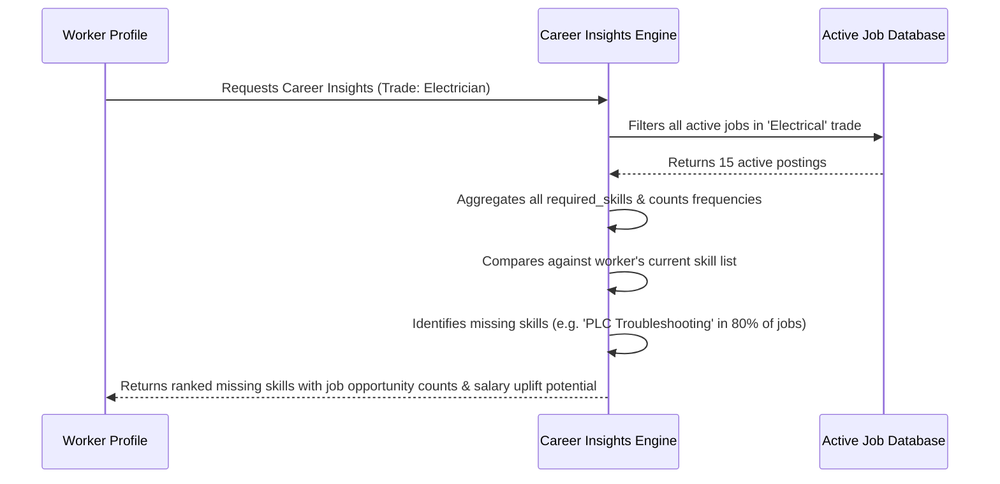

# KaushalConnect — Explainable Intelligence & Trust Engine

---

## 1. Overview & Core Philosophy

KaushalConnect rejects opaque "black-box" machine learning algorithms for recruitment. In high-stakes industrial hiring—where equipment safety, electrical high-voltage hazards, and pressure vessel integrity are paramount—both workers and plant managers demand **transparent, auditable, and explainable recommendations**.

The KaushalConnect Intelligence Layer is powered by deterministic, weighted scoring algorithms that evaluate compatibility across multiple verifiable dimensions while generating human-readable diagnostics.



---

## 2. 5-Pillar Match Score Algorithm

The compatibility score between a worker $W$ and a job opening $J$ is calculated as:

$$\text{Total Match Score} = S_{\text{skills}} + S_{\text{experience}} + S_{\text{location}} + S_{\text{certifications}} + S_{\text{availability}}$$

Where the maximum possible score is **100 points**.

### 2.1 Pillar 1: Skills Compatibility ($S_{\text{skills}}$ — Max 50 Points)
- Let $R$ be the set of required skills declared on Job $J$.
- Let $P$ be the set of preferred skills declared on Job $J$.
- Let $K$ be the set of skills held by Worker $W$.

$$\text{Required Ratio} = \frac{|K \cap R|}{|R|} \quad (\text{if } |R| > 0 \text{ else } 1.0)$$
$$\text{Preferred Ratio} = \frac{|K \cap P|}{|P|} \quad (\text{if } |P| > 0 \text{ else } 0.0)$$
$$S_{\text{skills}} = \text{round}((\text{Required Ratio} \times 40) + (\text{Preferred Ratio} \times 10))$$

### 2.2 Pillar 2: Experience Compatibility ($S_{\text{experience}}$ — Max 20 Points)
- Let $E_W$ be the worker's verified years of experience.
- Let $E_J$ be the job's minimum required experience.

$$S_{\text{experience}} = 
\begin{cases} 
20 & \text{if } E_W \ge E_J \\
\text{round}\left(20 \times \frac{E_W}{E_J}\right) & \text{if } 0 < E_W < E_J \\
10 & \text{if } E_J = 0
\end{cases}$$

### 2.3 Pillar 3: Location Proximity ($S_{\text{location}}$ — Max 15 Points)
- If Worker City matches Job City exactly: **15 Points**.
- If State or District matches: **8 Points**.
- Different Region / No Match: **3 Points**.

### 2.4 Pillar 4: Certification Fit ($S_{\text{certifications}}$ — Max 5 Points)
- If the worker holds at least one verified government trade diploma (NCVT / ITI / AWS): **5 Points** (else 0).

### 2.5 Pillar 5: Availability Compatibility ($S_{\text{availability}}$ — Max 10 Points)
- `available_now` (Immediate Joining): **10 Points**.
- `within_15_days`: **8 Points**.
- `within_1_month`: **5 Points**.
- `not_available`: **0 Points**.

---

## 3. Explainability Layer: Strengths & Gaps

Rather than presenting an isolated score (e.g. `88%`), the engine generates structured, human-readable diagnostics:

```json
{
  "match_percentage": 88,
  "breakdown": {
    "skills": { "score": 40, "max": 50, "matched": ["Three-Phase Wiring", "LT Switchgear"], "missing": ["PLC Troubleshooting"] },
    "experience": { "score": 20, "max": 20, "worker_years": 5, "required_years": 4 },
    "location": { "score": 15, "max": 15, "city_matched": true },
    "certifications": { "score": 5, "max": 5, "verified_certs": 2 },
    "availability": { "score": 8, "max": 10, "status": "within_15_days" }
  },
  "strengths": [
    "Possesses 2 core required skills: Three-Phase Wiring, LT Switchgear",
    "Exceeds required experience (5 yrs vs 4 yrs required)",
    "Located locally in Vijayawada",
    "Holds verified trade certifications"
  ],
  "gaps": [
    "Missing preferred skill: PLC Troubleshooting"
  ]
}
```

---

## 4. 100-Point Deterministic Trust Score Engine

The Trust Score provides an objective measure of worker credibility across 6 verifiable pillars:



| Pillar | Maximum Points | Calculation Rules |
| :--- | :--- | :--- |
| **1. Identity** | 20 Points | `is_verified == True` $\rightarrow$ 20 pts (Aadhaar / PAN checked) |
| **2. Certifications** | 20 Points | 10 pts per approved government/trade diploma (capped at 20) |
| **3. Skills** | 20 Points | 5 pts per verified technical competence (capped at 20) |
| **4. Experience** | 15 Points | 3 pts per year of verified industrial tenure (capped at 15) |
| **5. Reviews** | 15 Points | $\text{round}((\text{Average Rating} / 5.0) \times 15)$ from verified employers |
| **6. Proof of Work**| 10 Points | 2 pts per verified photographic project entry (capped at 10) |

$$\text{Total Trust Score} = \min(100, P_1 + P_2 + P_3 + P_4 + P_5 + P_6)$$

---

## 5. Market-Driven Career Gap Analysis

The Career Gap Engine analyzes active marketplace demand across the worker's trade category to highlight missing high-yield skills:



---

## 6. Algorithm Boundaries & Future Evolution

1. **Current Scope**: Fast, deterministic, sub-10ms evaluation with zero external API dependencies or GPU requirements.
2. **Future AI Evolution (Post-Hackathon)**:
   - Vector embeddings using `pgvector` for semantic skill synonym matching (e.g. matching *"MIG Welding"* with *"GMAW"*).
   - Machine learning-based salary prediction models based on regional manufacturing clusters.
