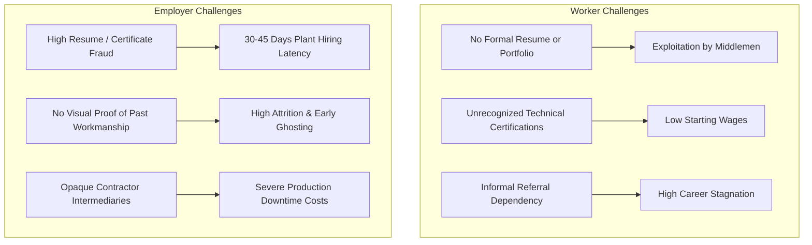
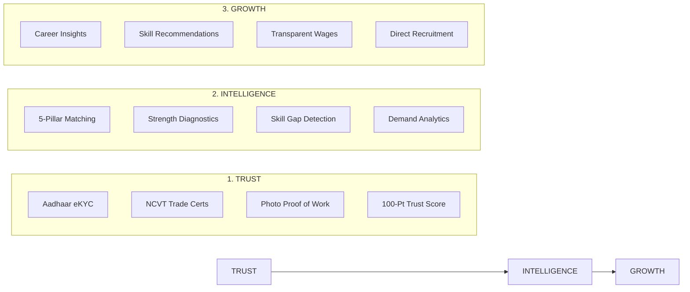
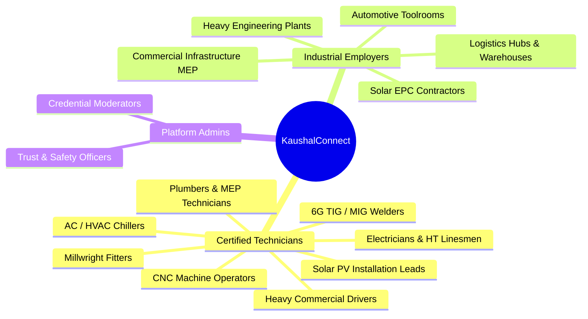

# KaushalConnect — Project & Product Overview

> **A Trust-Driven Professional Identity and Intelligent Recruitment Platform for India's Blue-Collar Workforce**  
> *Built for the Blue Workforce Connect '26 Hackathon by Wooble*

---

## 1. Executive Summary

India's industrial economy is powered by over 300 million skilled and semi-skilled blue-collar workers—including certified electricians, 6G pipe welders, CNC machinists, solar PV technicians, MEP pipefitters, and heavy plant mechanics. Despite their critical economic role, the blue-collar recruitment ecosystem remains fundamentally broken, fragmented, and informal.

**KaushalConnect** is a technology platform designed to bring institutional trust, digital credibility, and algorithmic recruitment efficiency to technical trade hiring in India. Rather than treating blue-collar workers as commodity labor through plain keyword searches and static resumes, KaushalConnect equips technicians with a **verified digital trade identity**, backed by an objective **100-Point Trust Score**, **Photo Proof-of-Work Portfolios**, and **Explainable AI Matching**.

---

## 2. The Problem

The blue-collar recruitment ecosystem in India suffers from severe structural friction:

1. **Information Asymmetry**: Employers cannot verify candidate claims regarding machine operation, welding grade, or HT substation maintenance without conducting costly physical trials.
2. **Credential Blindness**: Government ITI and NCVT diplomas are frequently overlooked or difficult to authenticate, forcing certified technicians to accept entry-level day wages.
3. **The Intermediary Trap**: Unregistered labor contractors extract 15–30% of workers' earnings while providing employers zero performance guarantees or background audit trails.
4. **Lack of Upward Mobility**: Technicians lack visibility into regional industrial demand and missing trade skills needed to earn higher monthly wages.

---

## 3. Why Existing Recruitment Methods Fail

| Method | Fatal Flaw | Why KaushalConnect Succeeds |
| :--- | :--- | :--- |
| **White-Collar Job Portals (LinkedIn, Naukri)** | Formatted for English resumes, corporate titles, and desk jobs. Completely inaccessible for trade technicians. | Trade-first visual profiles, multilingual interfaces, and photo proof of work. |
| **Classified Sites (OLX, Quickr)** | Unstructured text ads filled with spam, fraudulent contractors, and unverified wage listings. | Enterprise GST verification, structured salary bounds, and platform trust moderation. |
| **Informal Word-of-Mouth** | Geographically restricted, hyper-local, and limits recruiter reach during plant expansions. | Regional search matrices across industrial clusters with commute distance radius filters. |
| **Traditional Staffing Agencies** | High placement commissions, recurring payroll cuts, and zero candidate transparency. | Direct employer-to-worker connection with transparent trust and skill scoring. |

---

## 4. The KaushalConnect Solution: 3 Pillars of Innovation

KaushalConnect solves this systemic challenge through three foundational pillars:

### Pillar 1: Institutional Trust
Every worker builds a dynamic digital identity backed by an objective, 100-point deterministic Trust Score. Trust is earned through government identity checks, verified trade credentials, supervisor reviews, and authenticated photo portfolios of completed plant work.

### Pillar 2: Explainable Recruitment Intelligence
Employers don't just see percentage numbers—they receive transparent, human-readable explanations of why a candidate fits an industrial opening (e.g., *“+44/50 on Three-Phase Wiring, +18/20 on Plant Experience, Local Resident within 5km”*).

### Pillar 3: Career Growth & Demand Visibility
Workers gain clear visibility into high-demand trade skills across regional manufacturing hubs, empowering them to pursue upskilling opportunities that directly unlock higher wage brackets.

---

## 5. Target Users & Stakeholders

---

## 6. Core Value Propositions

### For Technicians & Blue-Collar Workers
- **Proof-of-Work Portfolio**: Showcase real industrial workmanship (e.g. HT breaker wiring, 6G pipe welds) directly to plant managers.
- **Fair Market Wages**: Direct access to verified enterprise jobs with transparent salary ranges (PF, ESI, overtime pay) and zero contractor deductions.
- **Skill Progression Insights**: Actionable recommendations highlighting exactly which skills (e.g. PLC Troubleshooting) unlock higher-paying jobs.

### For Industrial Recruiters & Plant HR
- **Faster Hiring**: Shortlist qualified, verified technicians in minutes instead of 30+ days.
- **Reduced Hiring Risk**: Objective trust breakdown before scheduling physical trade tests.
- **Complete Pipeline Control**: Manage applicants seamlessly from initial screening to trade test scheduling and formal offer issuance.

---

## 7. What Makes KaushalConnect Different

1. **Evidence Over Self-Claims**: Where others rely on unchecked resumes, KaushalConnect prioritizes photo proof of work and verified government diplomas.
2. **Algorithmic Transparency**: No opaque black-box AI algorithms. Every match score and trust point is completely explainable to both worker and employer.
3. **Structured Industrial Pipelines**: Purpose-built for trade assessments, plant visit scheduling, and supervisor performance tracking.
4. **Multilingual & Accessible**: Native support for English, Telugu, and Hindi to ensure zero digital literacy barriers.

---

## 8. Impact & Long-Term Vision

KaushalConnect aims to become the foundational digital infrastructure for skilled technical labor across India. By standardizing digital trade credentials and eliminating recruitment friction, the platform transforms technical trades from informal day labor into dignified, respected, and upwardly mobile industrial careers.
