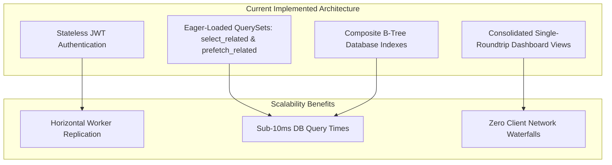

# KaushalConnect — Scalability & Production Evolution Strategy

---

## 1. Current Scalability Characteristics (Implemented)

The existing KaushalConnect codebase is designed with production-ready scalability foundations:



1. **Stateless API Design**: The Django backend stores zero session state in local memory or local server disk. Any incoming request can be handled by any worker instance.
2. **Zero N+1 Query Overhead**: Every list endpoint utilizes `select_related('employer')` or `select_related('user')` along with prefetching for related skills and proof of works.
3. **Composite Database Indexing**: Multi-column indexes on `Job[status, created_at]`, `Job[trade_category, city, status]`, `WorkerProfile[primary_trade, city]`, and `WorkerProfile[trust_score_total, availability]` ensure linear query performance as table size scales to millions of records.

---

## 2. Horizontal Scaling & Production Infrastructure Strategy

```mermaid
graph TB
    subgraph Edge Layer
        DNS[Route 53 / Cloudflare CDN]
        LB[Application Load Balancer / Nginx Reverse Proxy]
    end

    subgraph App Layer - Horizontal Auto-Scaling
        W1[Django WSGI Instance 1 (Gunicorn)]
        W2[Django WSGI Instance 2 (Gunicorn)]
        W3[Django WSGI Instance N (Gunicorn)]
    end

    subgraph Caching & Task Queues
        Redis_Cache[(Redis In-Memory Cache Cluster)]
        Celery_Workers[Celery Asynchronous Workers]
    end

    subgraph Data & Storage Layer
        PG_Primary[(PostgreSQL Primary DB - Writes)]
        PG_Replica[(PostgreSQL Read Replicas - Reads)]
        S3[(AWS S3 / GCS Cloud Object Storage)]
    end

    DNS --> LB
    LB --> W1 & W2 & W3
    W1 & W2 & W3 <--> Redis_Cache
    W1 & W2 & W3 --> Celery_Workers
    W1 & W2 & W3 --> PG_Primary
    W1 & W2 & W3 --> PG_Replica
    W1 & W2 & W3 --> S3
```

---

## 3. Caching & Performance Optimization Opportunities

| Component | Target Optimization | Target Technology |
| :--- | :--- | :--- |
| **Static Taxonomies** | Cache trade skills list (`/api/v1/skills/`) and location clusters with 24-hour TTL | Redis / Django Cache Framework |
| **Public Job Catalog** | Cache popular search queries (e.g. `Electrician in Vijayawada`) with 5-minute TTL | Redis Cache Layer |
| **Trust Score Results**| Cached in `WorkerProfile.trust_score_total`; invalidated only on review or certification change | Implemented |

---

## 4. Background Asynchronous Processing (Future Strategy)

Currently, email notifications and document status changes are processed synchronously within the request lifecycle. At enterprise scale, heavy operations will be offloaded to **Celery + Redis**:

- **SMS & WhatsApp Gateway Delivery**: Asynchronous delivery of interview alerts and application stage updates via Twilio / Fast2SMS.
- **DigiLocker Verification Webhooks**: Asynchronous polling and verification of government trade credentials.
- **Image Compression & EXIF Stripping**: Background thumbnail generation for proof-of-work photo uploads.

---

## 5. Storage & Search Evolution

1. **Object Storage**: Migrate static and media files from local disk to **AWS S3 / Google Cloud Storage** with private pre-signed URLs for sensitive identity documents (Aadhaar/PAN).
2. **Semantic Search via `pgvector`**: Introduce vector embeddings for trade skills to automatically bridge colloquial vernacular terminology with formal occupational titles (e.g., mapping *"GMAW"* $\leftrightarrow$ *"MIG Welding"*).
