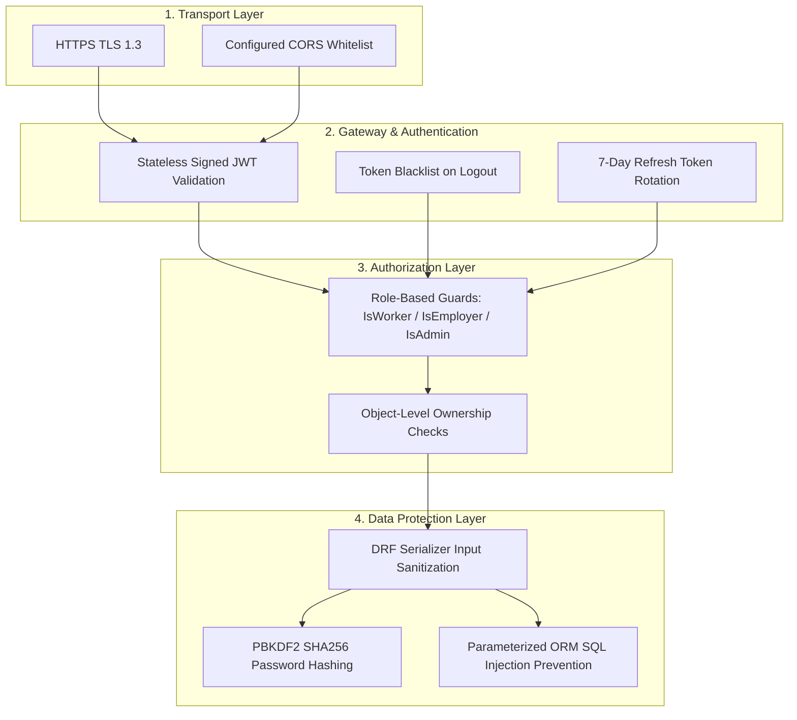

# KaushalConnect — Security, Privacy & Compliance Architecture

---

## 1. Security Overview

KaushalConnect handles sensitive worker identity credentials (Aadhaar cards, trade certificates), company registrations (GSTIN/CIN), wage details, and candidate contact numbers. The platform implements a **Defense-in-Depth Security Strategy** spanning transport encryption, stateless token security, strict Role-Based Access Control (RBAC), and sanitization layers.

---

## 2. Authentication & JWT Token Strategy

The platform uses `djangorestframework-simplejwt` for secure, stateless token authentication:

1. **Token Separation**:
   - **Access Token**: Short-lived (1 day in development, 1 hour in production), used to authenticate API requests via the `Authorization: Bearer <token>` header.
   - **Refresh Token**: Long-lived (7 days), used strictly at `/api/v1/auth/refresh/` to obtain a fresh access token.
2. **Cryptographic Signing**: Tokens are cryptographically signed using HMAC-SHA256 with the server's `DJANGO_SECRET_KEY`.
3. **Token Blacklisting**: When a user logs out (`POST /api/v1/auth/logout/`), the refresh token is registered in the blacklist database table, preventing replay attacks.
4. **Client-Side Storage**: In the frontend, tokens are stored securely in `localStorage` under `kc_tokens`, with automated Axios response interceptors intercepting HTTP 401 errors to perform silent refresh rotation.

---

## 3. Role-Based & Object-Level Access Control

### 3.1 Role Hierarchy & Permissions
The backend enforces explicit permission classes defined in `backend/common/permissions.py`:

| Permission Class | Condition Checked | Protected Actions |
| :--- | :--- | :--- |
| **`AllowAny`** | No authentication required | Registration, Login, Token Refresh, Public Job Search, Public Worker Discovery, API Docs |
| **`IsAuthenticated`**| Valid JWT token presented | Current User (`/auth/me/`), Notifications, Report Submission, Saved Bookmarks |
| **`IsWorker`** | `request.user.role == 'worker'` | Job Applications, Skills CRUD, Certifications CRUD, Proof of Work CRUD, Career Insights |
| **`IsEmployer`** | `request.user.role == 'employer'` | Job Creation, Job Updates, Application Stage Transitions, Trade Test Scheduling, Analytics |
| **`IsAdmin` / `IsStaff`** | `request.user.is_staff == True` | Verification Queue Approvals/Rejections, Platform Safety Report Resolution |

### 3.2 Object-Level Ownership Protection
- **Job Vacancies**: Employers can only edit, pause, or close jobs where `job.employer.user == request.user`.
- **Applications**: Workers can only view their own applications; Employers can only view applications submitted to jobs posted by their own company.
- **Supervisor Reviews**: Reviews can strictly only be submitted by the employer who hired the worker on an approved application.

---

## 4. Data Protection & Input Sanitization

1. **Password Security**: Passwords are never stored in plaintext. They are hashed using Django's default **PBKDF2 algorithm with SHA-256 hash** and 720,000 iterations.
2. **SQL Injection Prevention**: All queries utilize the Django ORM's parameterized query builder, eliminating raw SQL concatenation vulnerabilities.
3. **Cross-Site Scripting (XSS)**: React automatically escapes output rendered in JSX. API responses return structured JSON with strict MIME typing (`application/json`).
4. **Cross-Origin Resource Sharing (CORS)**: Managed via `django-cors-headers` with explicit domain whitelisting (`CORS_ALLOWED_ORIGINS`).

---

## 5. Production Security Considerations & Limitations

1. **Environment Configuration**: `SECRET_KEY` and database credentials must be injected via environment variables (`.env`) in production; `DEBUG` must be set to `False`.
2. **Media Storage**: Uploaded verification document scans (Aadhaar/PAN) should be stored in private, pre-signed S3 buckets rather than public web-accessible roots in production.
3. **Rate Limiting**: Production deployment should configure Django REST Framework throttling (`AnonRateThrottle`, `UserRateThrottle`) or Cloudflare DDoS shields to prevent endpoint brute-forcing.
