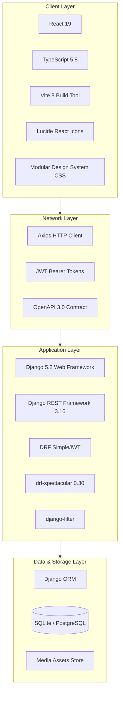

# KaushalConnect — Technology Stack & Engineering Decisions

---

## 1. Complete Technology Stack Matrix

---

## 2. Component-by-Component Technology Breakdown

### 2.1 Frontend Technologies
| Component | Technology | Selection Justification |
| :--- | :--- | :--- |
| **UI Library** | **React 19** | Industry standard component-driven rendering, concurrent rendering optimizations, and rich ecosystem. |
| **Language** | **TypeScript 5.8** | Static typing prevents runtime bugs, enforces strict API request/response contracts, and streamlines team development. |
| **Build Tooling** | **Vite 8** | Sub-second Hot Module Replacement (HMR) and optimized Rolldown production chunking. |
| **Styling** | **Vanilla CSS + Design Tokens** | Lightweight, zero-dependency, ultra-fast CSS variables with customized industrial color palettes and glassmorphism styling. |
| **Icons & Feedback**| **Lucide React + Canvas Confetti** | Accessible SVG iconography and visual celebration feedback upon application and verification milestones. |

---

### 2.2 Backend Technologies
| Component | Technology | Selection Justification |
| :--- | :--- | :--- |
| **Framework** | **Django 5.2** | Battle-tested, secure, batteries-included web framework with robust ORM migrations and admin tooling. |
| **API Layer** | **Django REST Framework 3.16** | Powerful class-based views, robust serializer validation, content negotiation, and standardized pagination. |
| **Authentication** | **SimpleJWT** | Secure, stateless JSON Web Token issuance, rotation, and cryptographic verification with token blacklisting. |
| **API Documentation** | **drf-spectacular 0.30** | Automated OpenAPI 3.0 schema generation with integrated Swagger UI (`/api/docs/`) and ReDoc (`/api/redoc/`). |
| **Query Filtering** | **django-filter** | Declarative query parameter filtering for high-performance job and worker discovery. |

---

### 2.3 Persistence & Storage
| Layer | Technology | Usage & Capabilities |
| :--- | :--- | :--- |
| **Development DB** | **SQLite** | Zero-configuration, file-backed database ideal for rapid demonstration, testing, and automated evaluation. |
| **Production DB** | **PostgreSQL + pgvector** | Enterprise relational database supporting ACID transactions, composite B-tree indexes, and vector embeddings. |
| **Media Handling** | **Django Media Store** | Handles worker photo proof-of-work uploads and certification scans. |

---

## 3. Engineering Decisions & Architectural Trade-Offs

### 1. Deterministic Scoring vs. Black-Box Neural Networks
- **Decision**: Built a transparent, 5-pillar mathematical scoring engine (`apps.matching`) rather than an opaque LLM/deep neural net.
- **Trade-Off**: Does not catch ultra-subtle linguistic nuances, but guarantees **100% auditability, zero hallucinations, zero GPU cloud costs**, and instantaneous sub-10ms response times.

### 2. Single-Roundtrip Dashboard Aggregation vs. Multiple API Calls
- **Decision**: Implemented `/api/v1/dashboard/worker/` and `/api/v1/dashboard/employer/` returning complete metrics in a single roundtrip.
- **Trade-Off**: Slightly larger initial payload, but eliminates frontend network waterfalls, reduces mobile data consumption, and avoids UI flickering.

### 3. Dual Storage (Local Storage + Live REST Sync)
- **Decision**: The frontend `Store` caches state in `localStorage` and asynchronously synchronizes with backend REST endpoints.
- **Trade-Off**: Requires cache invalidation discipline, but provides instantaneous optimistic UI updates and seamless offline-first resilience.
