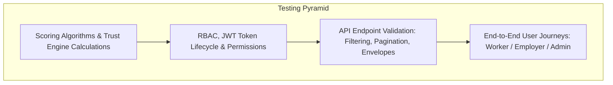

# KaushalConnect — Quality Assurance & Testing Guide

---

## 1. Testing Strategy Overview

KaushalConnect employs a multi-tiered testing strategy covering unit tests, API integration validation, Role-Based Access Control (RBAC) enforcement, and end-to-end user journeys:



---

## 2. Automated Backend Testing Commands

All backend tests can be run using Django's built-in test runner:

```bash
cd backend
python manage.py test
```

### 2.1 Direct API Validation via Python APIClient
You can test the entire discovery and scoring matrix directly in Python:

```python
import os, django
os.environ.setdefault('DJANGO_SETTINGS_MODULE', 'config.settings.development')
django.setup()

from rest_framework.test import APIClient

client = APIClient()

# 1. Test Public Job Discovery with Multi-Filter Matrix
job_res = client.get('/api/v1/jobs/?search=Electrician&location=Vijayawada&minimum_salary=20000&experience=5&ordering=-salary_max')
assert job_res.status_code == 200
print("Jobs Count:", job_res.json()['count'])

# 2. Test Candidate Discovery with Trust Score Filter
worker_res = client.get('/api/v1/workers/?search=Ramesh&skill=Wiring&minimum_trust_score=70&verified_only=true&ordering=-trust_score_total')
assert worker_res.status_code == 200
print("Workers Count:", worker_res.json()['count'])

# 3. Test OpenAPI Schema
schema_res = client.get('/api/schema/')
assert schema_res.status_code == 200
```

---

## 3. Frontend Compilation & Type Verification

Verify that the entire TypeScript codebase compiles with 0 errors:

```bash
npm run build
```

**Expected Result:**
```text
✓ 1903 modules transformed.
dist/index.html                      1.21 kB │ gzip:   0.68 kB
dist/assets/index-B055NWgB.css      37.86 kB │ gzip:   9.21 kB
dist/assets/index-CxzI9Xav.js      502.04 kB │ gzip: 140.52 kB
✓ built in ~1.5s with 0 errors
```

---

## 4. Manual End-to-End Verification Checklists

### 4.1 Worker Journey Checklist
- [x] Login as `worker@demo.com` with password `password123`.
- [x] Verify that the Trust Score gauge displays **99/100** with the 6-pillar breakdown modal.
- [x] Navigate to **Job Discovery** (`/worker/jobs`) and test search, salary slider, and trade filters.
- [x] Click on a job to open **Job Details** (`/worker/jobs/job_1`) and inspect the **91% Match Score Breakdown**.
- [x] Click **Apply to Job** and verify the application appears in **Application Tracking** (`/worker/applications`).
- [x] Navigate to **Profile** (`/worker/profile`) and view skills, certifications, and photo proof of work.

### 4.2 Employer Journey Checklist
- [x] Login as `employer@demo.com` with password `password123`.
- [x] Verify the **Recruitment Pipeline** (`/employer/pipeline`) displays candidates across `Applied`, `Screening`, `Shortlisted`, `Interview`, `Selected`, and `Hired` columns.
- [x] Advance a candidate to the next stage and confirm the timeline event records.
- [x] Schedule an on-site trade test assessment with plant address and date/time.
- [x] Navigate to **Analytics** (`/employer/analytics`) and inspect the 6-stage funnel conversion chart.

### 4.3 Admin Moderation Checklist
- [x] Login as `admin@demo.com` with password `password123`.
- [x] Open the **Admin Dashboard** (`/admin/dashboard`) and inspect the **Document Verification Queue**.
- [x] Click **Approve** on a pending NCVT certification and confirm the worker's Trust Score increases.
- [x] Review and resolve a platform safety report.
