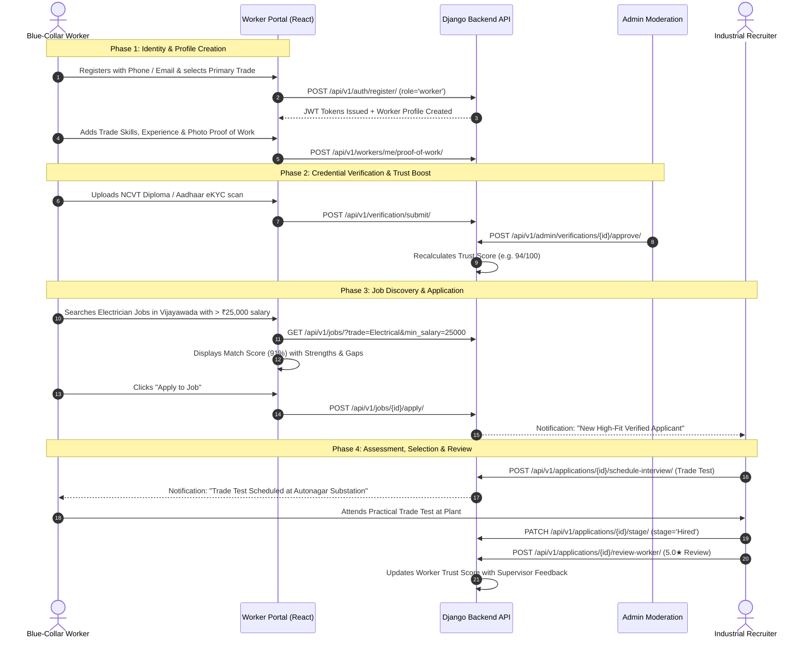
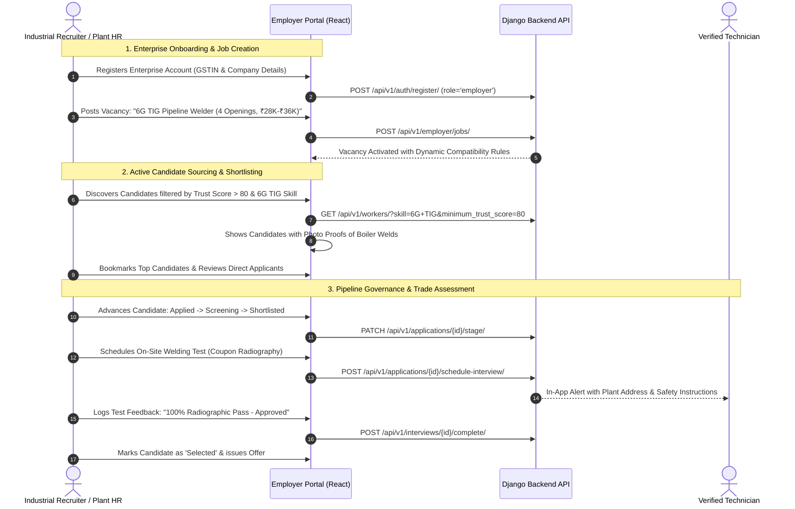
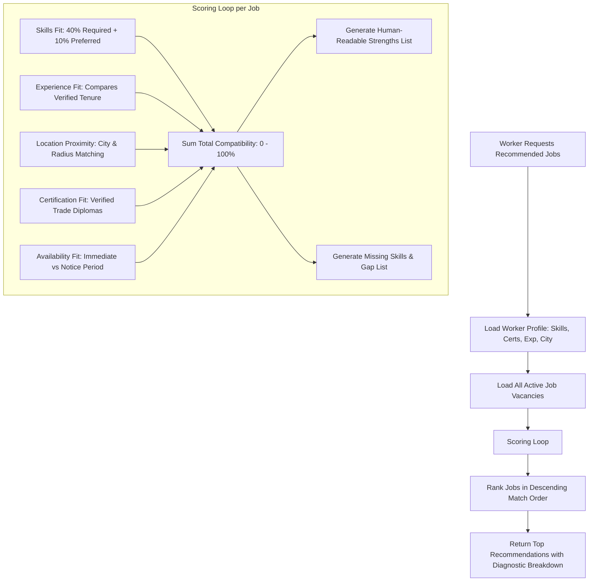
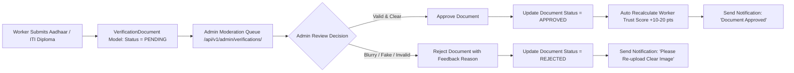

# KaushalConnect — End-to-End User Journeys & Workflow Diagrams

---

## 1. Worker Journey: From Onboarding to Industrial Employment

---

## 2. Employer Journey: Industrial Talent Acquisition & Pipeline

---

## 3. Explainable AI Matching & Recommendation Flow

---

## 4. Admin Verification & Platform Moderation Flow

